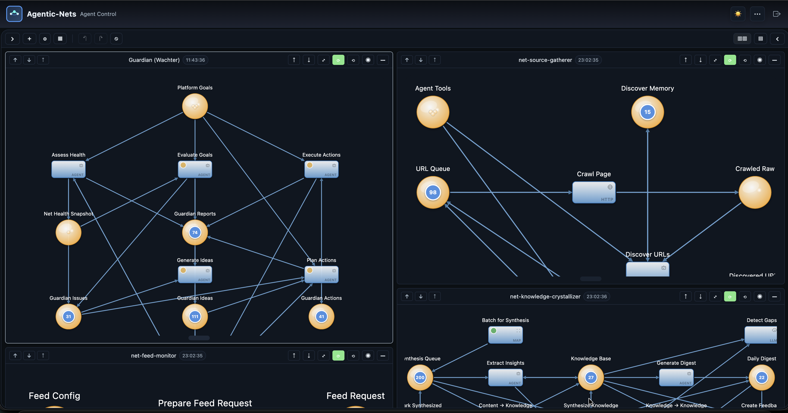
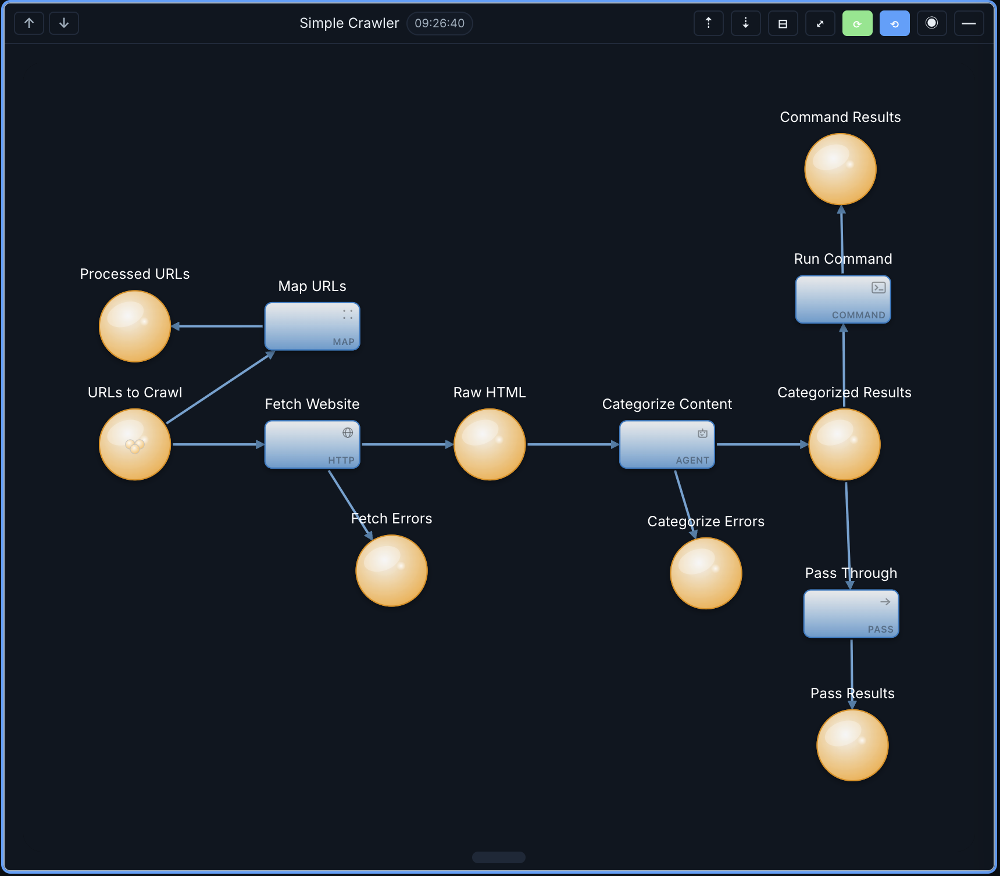

# Agentic-Nets


**Governed multi-agent runtime. Your agents stop running naked.**

Agentic-Nets is a runtime where agents live inside formal Petri nets and use
those nets as context. A net defines what an agent can see, what it can do,
where outputs go, and how it communicates with other nets. One net can model a
single guarded agent or several agents working together inside the same net.
Multiple nets can model a development pipeline, a virtual agile team, or an
entire product operating system. The same approach is not tied to software
alone: you can model any domain, process, or industry with nets as long as
structure, communication, coordination, and verification matter.

[](https://www.youtube.com/watch?v=orI-u5YT7Go)

Watch the product preview on YouTube: [agentic-nets preview](https://www.youtube.com/watch?v=orI-u5YT7Go)

If prompt-based agents feel powerful but structurally weak, this is the missing
layer:

- **Agents live in nets.** Context is structured state, not a fragile chat session.
- **Nets talk to nets.** Teams, tools, approvals, memory, and pipelines become explicit handoffs.
- **Everything stays inspectable.** Tokens, tool calls, events, and emissions remain queryable and replayable.
- **The same model scales up.** Build one guarded developer agent or a whole product runtime with the same primitives.

## What you can model with it

- Virtual developers with explicit permissions, memory, and execution boundaries.
- Virtual agile teams where planner, builder, reviewer, tester, and releaser agents coordinate through nets.
- Smart development tools that behave like reusable nets instead of throwaway prompts.
- Development pipelines that generate code, run checks, gate releases, and keep a durable audit trail.
- Product-level systems where backlog, QA, docs, incidents, and operations communicate as structured nets.
- Industry-specific operating models in software, finance, support, operations, research, healthcare, logistics, or any other domain that can be expressed as communicating nets.

## Net of nets

One net can contain one or many agents. Many nets can also work together as a
larger runtime: one can guard, one can gather, one can synthesize, one can
execute, and all of them can exchange structured state through explicit flows
instead of hidden prompt handoffs.



## Example net

This simple crawler net shows the model in practice: places hold the state,
`http` fetches, an `agent` transition categorizes content, a `command`
transition runs remote work through an executor, and `map` plus `pass`
transitions route results through the graph.



## How behavior is modeled

Agentic-Nets uses **seven transition types**: `pass`, `map`, `http`, `llm`,
`agent`, `command`, and `link`.

- **`agent` transitions are the core runtime primitive.** They can mimic almost any agent behavior or mode, but inside a governed net with explicit inputs, outputs, permissions, and memory boundaries.
- **`agent` transitions can also adapt the net itself.** If an agent has sufficient rights, it can read tokens in the net, create additional places and transitions, and extend the structure on demand instead of staying confined to a fixed graph.
- **`command` transitions connect the net to remote execution.** They define which executor can run a command remotely and bring the result back into the net as structured state.
- **Deterministic and non-deterministic transitions coexist.** Fixed logic can stay fixed, while open-ended reasoning stays open-ended, in the same runtime and on the same graph.
- **This is what makes the model powerful across domains.** A net can combine several cooperating agents with deterministic control flow, verification, remote execution, and cross-net communication.

## The nine production gaps Agentic-Nets closes

1. **Invisible state.** Every intermediate value is a token in a typed place, queryable with ArcQL while the net runs.
2. **Vanishing memory.** Memory is structured state. Agents read and write lessons through places and `EMIT_MEMORY`.
3. **Weak observability.** State is event-sourced. Replay the log, inspect reductions, and ask what existed at decision time.
4. **No permission model.** Role tiers from `r----` to `rwxhl` gate tools at dispatch, not in the prompt.
5. **Secrets in the wrong place.** Vault keeps credentials outside tokens and events, scoped per transition and injected only at action time.
6. **Unsafe execution boundary.** Remote executors poll over egress-only links; command work runs in scoped Docker tool containers.
7. **Hard to explain why.** Tool calls, results, emissions, and event trails keep provenance attached to the actual work.
8. **Poor reusability.** Agents are transitions with inscriptions. Export inscriptions or PNML and reuse the net elsewhere.
9. **No reflexive model.** Builder agents can create nets, places, arcs, transitions, and inscriptions inside the same runtime.

## Why this matters for coding agents

Most coding agents disappear after they ship code. The prompt is gone, the
checks are ad hoc, and the verification logic is not part of the product.

Agentic-Nets lets an agent do more than implement a feature. It can also create
the surrounding operating structure: unit tests, integration tests, and even a
dedicated verification net that stays in the system and can be reused against
future changes. That turns one-off AI output into durable runtime structure and
addresses some of the biggest weaknesses of coding agents: weak handoffs,
fragile memory, and missing long-term verification.

**Full docs and install chapter:** [agentic-nets.com](https://agentic-nets.com) *(see also the [Install chapter in-repo](#-install-in-5-minutes))*.

> **BETA — USE AT YOUR OWN RISK.** In active development; may contain bugs,
> incomplete features, and breaking changes. No warranty. See
> [LICENSE.md](LICENSE.md) and [PROPRIETARY-EULA.md](PROPRIETARY-EULA.md).

## What's open source, what's closed source, and who can use it

Agentic-Nets ships as a **hybrid stack** — mixed open-source services and closed-source Docker Hub images. Read this before deploying.

| Layer | What | License | Who can use it |
|---|---|---|---|
| **Open source** (source code in this repo) | `agentic-net-gateway`, `agentic-net-executor`, `agentic-net-vault`, `agentic-net-cli`, `agentic-net-chat`, `sa-blobstore`, `agentic-net-tools/`, `deployment/`, `monitoring/` | [BSL 1.1](LICENSE.md) | Free for development, testing, personal, educational, and evaluation use. **Commercial production use requires a commercial license.** Converts to Apache 2.0 on 2030-02-22. |
| **Closed source** (Docker Hub images only — no source in this repo) | `alexejsailer/agenticnetos-node`, `alexejsailer/agenticnetos-master`, `alexejsailer/agenticnetos-gui` | [Proprietary EULA](PROPRIETARY-EULA.md) | Free for personal, educational, evaluation, and non-commercial use. **Commercial use requires contacting [alexejsailer@gmail.com](mailto:alexejsailer@gmail.com).** |

Both licenses include a strong **NO WARRANTY / BETA** disclaimer. Nothing here is certified for regulated environments out of the box — you are responsible for your own risk assessment. If you are unsure whether your intended use counts as commercial production, **ask before deploying**.

---

## Welcome to Agentic-Nets

**Prompts with tools get you started. Agentic-Nets makes agents operable.**

> "Chat agents are great for exploration. Agentic-Nets are what you use when exploration becomes production work."

---

## It's 3 AM

An agent you deployed last week is running autonomously. It's calling your
customer database. It's pushing code. It's executing shell commands on a
payment server. The logs say it did 27 tasks and made 41 API calls.

Then your phone buzzes. The agent hit a rate limit, retried 43 times, burned
$200 in credits. Worse, it opened a PR overwriting a critical config file.
CI picked it up. Deployment started. Nobody was watching.

You want to understand what happened. You open the conversation. It's gone.
The session expired. The agent's reasoning — *why* it retried, *what* data
it saw, *what* alternatives it considered — all vanished. The logs show
**what** happened, not **why**.

This is the state of most agent frameworks today. They solve the *"how do I
call an LLM"* problem brilliantly and leave three problems unsolved:
**invisible state**, **ephemeral memory**, **ungoverned execution**.
Agentic-Nets is built to solve exactly those three.

---

## Install in 5 minutes

You need Docker Desktop or Docker Engine with Compose v2, plus one LLM backend:
Claude API, OpenAI API, or local Ollama. You do **not** need Java, Node.js, or
Maven unless you want to build services from source.

Apple Silicon Macs can run the current Docker Hub images through Docker
Desktop's `linux/amd64` emulation. Docker may print platform-mismatch warnings
on first start; that is expected unless multi-arch images have been published
for your release.

```bash
# 1. Clone the public repo
git clone https://github.com/alexejsailer/agentic-nets.git
cd agentic-nets/deployment

# 2. Create your env file
cp .env.template .env

# 3. Edit .env and choose ONE provider:
#    Claude: LLM_PROVIDER=claude + ANTHROPIC_API_KEY=sk-ant-...
#    Ollama: LLM_PROVIDER=ollama (bundled container — no host install required).
#            Default model: deepseek-v3.1:671b-cloud (routes through ollama.com,
#            requires a one-time login — see step 5). To run fully offline instead,
#            set OLLAMA_MODEL (and the HIGH/MEDIUM/LOW tiers) to a local tag
#            like llama3.2 before starting the stack.
#    OpenAI: LLM_PROVIDER=openai + OPENAI_API_KEY=sk-...

# 4A. Start the full stack with monitoring
docker compose -f docker-compose.hub-only.yml up -d

# 4B. Or start the lighter stack without Grafana/Prometheus/Tempo
# docker compose -f docker-compose.hub-only.no-monitoring.yml up -d

# If startup says port 5001 is already allocated, edit .env and set:
# AGENTICNETOS_REGISTRY_PORT=5002
# Then rerun the same docker compose command.

# 5. If you chose Ollama, authenticate or pull the model into the bundled container:
#    (a) Default cloud model — one-time interactive login (see note below):
docker exec -it agenticnetos-ollama ollama signin
#    (b) OR, if you switched to a local model (e.g. llama3.2), pull it instead:
# docker exec agenticnetos-ollama ollama pull llama3.2

# 6. Optional: seed approved Docker tool images into the local registry.
#    Agents use these for crawler/RSS/search/Reddit/API helper containers.
docker compose -f docker-compose.hub-only.yml --profile tools run --rm agenticos-tool-seeder

# 7. Grab the admin secret the Studio login page asks for.
#    The gateway auto-generates it on first startup and bind-mounts it onto
#    the host — read it from the host (NOT from inside the container):
cat data/gateway/jwt/admin-secret

# 8. Open the Studio GUI and paste the secret into the login page
open http://localhost:4200
```

> **Where does the admin secret come from?**
> `agentic-net-gateway` writes a random admin secret to
> `deployment/data/gateway/jwt/admin-secret` on its first start. Read that
> file on the host and paste the value into the Studio login page (tick
> *Read-only access* if you want a read-only JWT — same secret, the gateway
> mints a scoped token). CLI, chat, and executor mount the same file
> read-only and auto-acquire their JWTs, so you don't need to configure them.
> If you prefer a pinned value, set `AGENTICOS_ADMIN_SECRET=<long-random-string>`
> in `.env` before `docker compose up -d` — that string then becomes the
> login secret.

> **Where does the Ollama login token come from?**
> `ollama signin` is a one-time pairing: it prints a URL + device code to the
> container logs, you open that URL in a browser, sign in to your
> [ollama.com](https://ollama.com) account, and approve the device. No token
> file to manage — credentials are stored inside the container at
> `/root/.ollama/` and survive restarts (the `ollama-data` volume).
> If you prefer non-interactive auth, generate an API key at
> [ollama.com/settings/keys](https://ollama.com/settings/keys) and pass it:
> `docker exec agenticnetos-ollama ollama signin <your-api-key>`.
> Cloud-suffixed models (`:cloud`, `:671b-cloud`, etc.) route through
> ollama.com and can be rate-limited during long sessions — swap to a local
> tag if you hit `429` errors.

**You don't write any code for the first run.** Open the Universal Assistant in
the Studio and ask *"Help me build my first net."* For write operations, switch
to or invoke the Workflow Builder persona. It can create places, transitions,
arcs, inscriptions, and deploy the result in the active model/session.

### Compose choices

| File | What it starts | Use it when |
|---|---|---|
| `deployment/docker-compose.hub-only.yml` | Complete local stack from Docker Hub, including monitoring | You want the production-like local setup |
| `deployment/docker-compose.hub-only.no-monitoring.yml` | Complete runtime stack from Docker Hub, no monitoring | You want a lighter laptop setup |
| `deployment/docker-compose.yml` | Closed-source core images from Docker Hub + open-source services built locally | You are developing this repo |

The `.env.template` is fully commented. The most important variables are:

| Variable | Purpose |
|---|---|
| `AGENTICNETOS_VERSION` | Docker Hub image tag. Release CI pins this. |
| `AGENTICNETOS_BIND_ADDRESS` | Defaults to `127.0.0.1` so published ports stay local. |
| `LLM_PROVIDER` | `ollama`, `claude`, `openai`, `claude-code`, or `codex`. |
| `ANTHROPIC_API_KEY`, `OPENAI_API_KEY` | Required only for those hosted providers. |
| `OLLAMA_BASE_URL`, `OLLAMA_MODEL` | Required for local Ollama. |
| `OPENBAO_DEV_ROOT_TOKEN` | Local Vault token. Change before exposing the stack. |
| `AGENTICNETOS_NODE_DATA_DIR` | Host directory for Node events and snapshots. |

Detailed install, env, verification, and troubleshooting:
[deployment/README.md](deployment/README.md).

---

## Release Notes

The active [`CHANGELOG.md`](CHANGELOG.md) tracks the **current calendar
quarter**. Older quarters are archived under
[`changelogs/`](changelogs/) ([index](changelogs/README.md)).

| Quarter | Highlights |
|---|---|
| **Current** | [`CHANGELOG.md`](CHANGELOG.md) |
| 2026 Q1 | First releases (`v1.6.0` → `v1.19.0`), repo split, `v1.2.0` launch — [archive](changelogs/CHANGELOG-2026-Q1.md) |
| 2025 Q4 | Pre-release: distributed execution, agent transitions, outbound-only architecture, designtime API — [archive](changelogs/CHANGELOG-2025-Q4.md) |
| 2025 Q3 | Pre-release: project foundations, multi-model architecture, NL→PNML, GUI editor — [archive](changelogs/CHANGELOG-2025-Q3.md) |

---

## What makes this different

|  | Prompt-with-tools frameworks | Agentic-Nets |
|---|---|---|
| **What can this agent see?** | Whatever you paste into context | Only the tokens in its inbound places |
| **What can this agent do?** | Whatever tools you register | Only tools its role unlocks (`r---` → `rwxh`) |
| **Where do its outputs go?** | Back to you, mixed with reasoning | Typed tokens in declared outbound places |
| **What did it actually do?** | Chat transcript | Token trail with full provenance |
| **How does it get cheaper?** | It doesn't | Crystallization — agent steps collapse into deterministic transitions |

Hallucination isn't prevented by prompt engineering; it's prevented by the
graph.

---

## Architecture

```
    CLIENT AGENTS  (all authenticate via gateway-minted JWT)
  +--------------+  +--------------+  +--------------+  +---------------+
  | agentic-net  |  | agentic-net  |  | agentic-net  |  | agentic-net   |
  | gui (4200)   |  | cli          |  | chat         |  | executor      |
  | Closed-src   |  | Open-src     |  | (Telegram)   |  |  (8084)       |
  |              |  |              |  | Open-src     |  | Open-src      |
  +------+-------+  +------+-------+  +------+-------+  +------+--------+
         |                 |                 |                 |
         | JWT             | JWT             | JWT             | JWT *
         |                 |                 |                 |
         +-----------------+--------+--------+-----------------+
                                    |
                                    | (all client traffic funnels
                                    |  through the gateway;
                                    |  tokens minted from the
                                    |  admin secret auto-generated
                                    |  on first startup at
                                    |  data/gateway/jwt/admin-secret
                                    |  and mounted read-only by
                                    |  cli, chat, executor)
                                    v
                         +-------------------+
                         | agentic-net-      |   Open-source (this repo)
                         | gateway (8083)    |   OAuth2 + JWT router
                         +---+------------+--+
                             |            |
                +------------v+         +-v---------------+
                | agentic-net |         | agentic-net     |   Closed-source (Docker Hub)
                | master      |<------->| node            |   orchestration + state engine
                |  (8082)     |         |  (8080)         |
                +--+--------+-+         +-----------------+
                   |        |
                   |        |   BACKEND SERVICES
                   |        |   (master-internal,
                   |        |    not client-exposed)
                   |        |
          +--------v--+  +--v-----------+
          | agentic-  |  | sa-blobstore |   Open-source (this repo)
          | net-vault |  |  (8090)      |   backend data tier
          |  (8085)   |  | large tokens |
          | secrets   |  | + knowledge  |
          +-----------+  +--------------+

  * Executor supports dual-mode polling: JWT via gateway (shown above, works
    across firewalls) OR direct to master on the same compose network.
```

### Agent roles on the wire

Every agent runs under a **capability role** (`rwxhl` Unix-style flags):

| Flag | Capability | Typical tools available |
|---|---|---|
| `r` | Read | `QUERY_TOKENS`, `LIST_PLACES`, `GET_NET_STRUCTURE`, `DESCRIBE_TOOL_NET`, discovery |
| `w` | Write | + `CREATE_TOKEN`, `SET_INSCRIPTION`, `CREATE_NET`, `TAG_SESSION`, `REGISTER_TOOL_NET` |
| `x` | Execute | + `DEPLOY_TRANSITION`, `START_TRANSITION`, `FIRE_ONCE`, `INVOKE_TOOL_NET`, `DELEGATE_TASK` |
| `h` | HTTP | + external HTTP calls |
| `l` | Logs | + event-line observability |

Pick minimal. A read-only diagnostic agent gets `r----`; a full coordinator
gets `rwxhl`. The runtime refuses tool calls outside the configured role.

### Executor polling modes

Executor agents use **egress-only polling** — firewall-friendly, deployable
anywhere:

| Mode | When | Executor polls | Auth |
|------|------|----------------|------|
| **Direct** | Same network as master | `http://agentic-net-master:8082` | None (internal) |
| **Gateway** | Remote / different network | `http://<gateway-host>:8083` | JWT (auto-acquired) |

### Open-source services (this repo)

| Service | Purpose | Port |
|---------|---------|------|
| **agentic-net-gateway** | OAuth2 API gateway with JWT auth, rate limits, read-only scopes | 8083 |
| **agentic-net-executor** | Distributed command execution agent, polls master direct or via gateway | 8084 |
| **agentic-net-vault** | Secrets management (OpenBao wrapper) for agent-transition credentials | 8085 |
| **agentic-net-cli** | Command-line agent with multi-provider LLM routing and tool-catalog sync | — |
| **agentic-net-chat** | Telegram-facing agent with streaming tool-call batches and `/verbose` toggle | — |
| **sa-blobstore** | Distributed blob storage for large tokens, artifacts, and knowledge content | 8090 |
| **agentic-net-tools/** | Tool containers agents start on demand (crawler, echo, reddit, rss, search, secured-api) | dynamic |

Docker tools are published as `alexejsailer/agenticos-tool-*:<version>` and mirrored into the bundled local registry (`localhost:5001`) by `agenticos-tool-seeder`. Master only runs images matching the local allowlist, normally `localhost:5001/agenticos-*`.

### Closed-source services (Docker Hub)

| Image | Purpose | Port |
|-------|---------|------|
| `alexejsailer/agenticnetos-node` | Event-sourced state engine, tree-structured persistence, ArcQL queries | 8080 |
| `alexejsailer/agenticnetos-master` | Orchestration, LLM integration, transition engine, agent runtime | 8082 |
| `alexejsailer/agenticnetos-gui` | Angular visual editor with drag-drop Petri-net design | 4200 |

These images are governed by the [Proprietary EULA](PROPRIETARY-EULA.md).

Full architecture deep dive: see [ARCHITECTURE.md](ARCHITECTURE.md).

---

## Repository structure

```
agentic-nets/
├── LICENSE.md                    # BSL 1.1 (open-source code)
├── PROPRIETARY-EULA.md           # EULA for Docker Hub images
├── README.md                     # (this file)
├── ARCHITECTURE.md               # Deep dive: transitions, ArcQL, coordination
├── CHANGELOG.md                  # Human-curated release notes
├── CONTRIBUTING.md               # How to contribute
│
├── agentic-net-gateway/          # OAuth2 API gateway (Spring Boot)
├── agentic-net-executor/         # Command executor (Spring Boot)
├── agentic-net-vault/            # Secrets wrapper for OpenBao (Spring Boot)
├── agentic-net-cli/              # CLI agent (TypeScript/Node)
├── agentic-net-chat/             # Telegram-facing agent (TypeScript/Node)
├── sa-blobstore/                 # Distributed blob storage (Spring Boot)
├── agentic-net-tools/            # Tool containers (Docker)
│
├── deployment/
│   ├── README.md                 # Local Docker Compose install guide
│   ├── docker-compose.yml        # Hybrid: Hub images + local builds
│   ├── docker-compose.hub-only.yml  # All services from Docker Hub + monitoring
│   ├── docker-compose.hub-only.no-monitoring.yml  # Runtime stack without monitoring
│   ├── .env.template             # Environment config template
│   ├── dockerfiles/              # Build files for open-source services
│   └── scripts/
│       ├── build-and-push.sh     # Build & push open-source images
│       └── seed-tool-registry.sh # Mirror/build Docker tools into local registry
│
└── monitoring/
    ├── config/                   # OTel, Prometheus, Tempo configs
    └── grafana-provisioning/     # Dashboards and datasources
```

---

## Licensing

Dual-license model:

- **Source code in this repo** — [BSL 1.1](LICENSE.md). Free for development,
  testing, personal, educational, evaluation. Commercial production use
  requires a commercial license. Converts to Apache 2.0 on 2030-02-22.
- **Closed-source Docker Hub images** (`agenticnetos-node`, `agenticnetos-master`,
  `agenticnetos-gui`) — [Proprietary EULA](PROPRIETARY-EULA.md). Free for
  personal, educational, evaluation, non-commercial use. Commercial use
  requires contact at alexejsailer@gmail.com.

**ALL SOFTWARE IS PROVIDED AS-IS WITH ABSOLUTELY NO WARRANTY.**

---

## Contact

- **Commercial licensing**: alexejsailer@gmail.com
- **Website & blog**: https://alexejsailer.com
- **Hosted docs**: https://agentic-nets.com
- **Video walkthroughs (YouTube)**: [Agentic-Nets playlist](https://www.youtube.com/playlist?list=PLW1ujxCEmjT0h9JgrUbMuxM2Pv2gsWnFb)
- **Issues**: https://github.com/alexejsailer/agentic-nets/issues
- **Contributing**: see [CONTRIBUTING.md](CONTRIBUTING.md)

---

> _Much of this codebase was built with AI pair programming. Commits
> co-authored by `Claude Opus 4.7 (1M context)` are part of that story — it
> felt right for a governed multi-agent runtime to be built, in part, by
> agents. See [CHANGELOG.md](CHANGELOG.md) for the human-curated release notes._

Copyright (c) 2025-2026 Alexej Sailer. All rights reserved.
