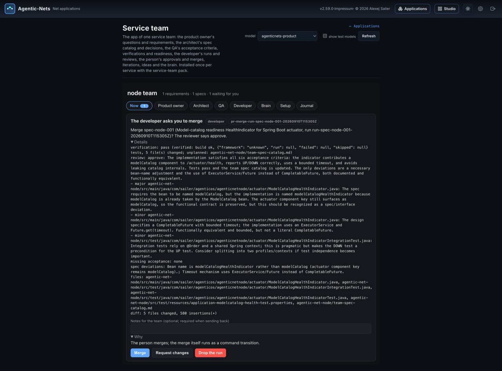
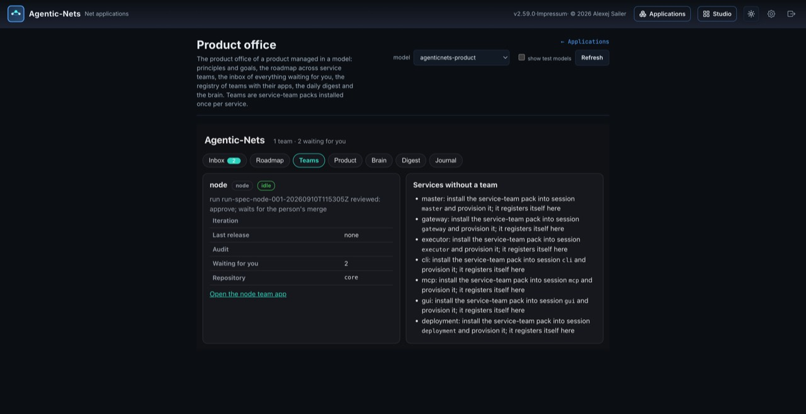
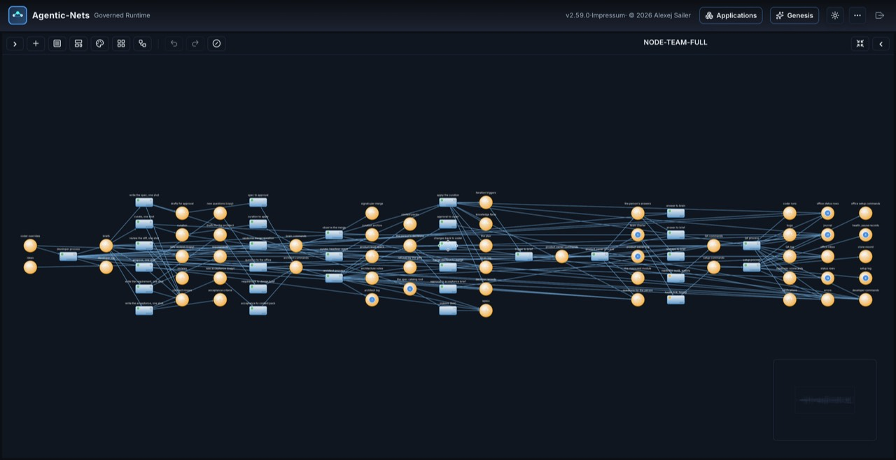
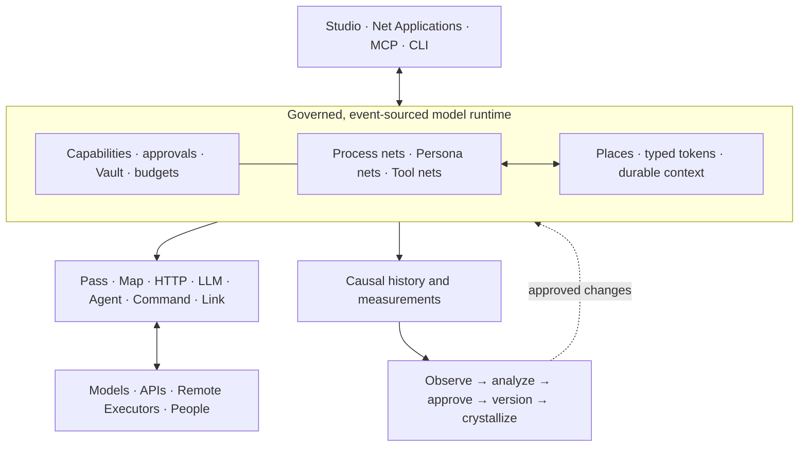

# Agentic-Nets


[](https://github.com/alexejsailer/agentic-nets/actions/workflows/ci.yml)
[](LICENSE.md)
[](https://github.com/alexejsailer/agentic-nets/releases/latest)
[](https://agentic-nets.com)
[](https://forum.agentic-nets.com)

**A graph harness for AI agents: build processes that keep running, remain
observable, and become more deterministic over time.**

Agentic-Nets is a governed, event-sourced runtime where AI agents,
deterministic automation, and people work on the same visible state. The
runtime owns the process, permissions, execution, and history; intelligence
can come from a server model, a local model, or the MCP client you already use.

> Graph harness for AI agents: a governed runtime on bipartite graphs (places
> and transitions) that executes models with scoped permissions, durable state
> and replayable history.

**[Try a live net—no install or login](https://agentic-nets.com/#/shared-net/bd685551-ed9b-48ff-bf0c-6c32520d6f68)** ·
**[Download Desktop Lite](https://github.com/alexejsailer/agentic-nets/releases/latest)** ·
**[Watch the 8-minute guided tour](https://youtu.be/hgW11A_7vWY)** ·
**[Read the documentation](docs/README.md)**

## A Product That Develops Itself

**An adaptive interface for coding agents and the graph harness around them.**

[](https://alexejsailer.com/2026/09/11/a-product-that-develops-itself-product-office-and-service-teams-on-agentic-nets/)

*The Service Team application at an explicit control point. The virtual team has
prepared, implemented, verified, and reviewed a real change to Agentic-Nets.
The person decides whether to merge it, request changes, or drop the run.*

Previously, [Hermann](https://alexejsailer.com/2026/09/07/hermann-twelve-factor-developer-that-lives-in-a-net/)
was one virtual developer living in a net. Now Agentic-Nets runs the software
organization around the coding agent. A Product Office maintains the product
goal, roadmap, team registry, and shared decision inbox. For each service placed
under management, a namespaced Service Team provides a virtual Product Owner,
Architect, QA Engineer, Developer, Brain, and Setup function.

The organization itself is a set of persistently deployed, event-driven
bipartite nets. Places hold durable requirements, specs, decisions, context,
evidence, and questions. Transitions perform the work when the required state
arrives. A coding run can finish; the team, its memory, its schedules, and its
open decisions remain alive.

The roles form a governed delivery loop:

1. The **Product Owner** measures the code before creating a requirement.
2. The **Architect** owns the spec, decisions, linked catalog, and exact context
   pack.
3. **QA** defines executable acceptance criteria and independently verifies the
   result.
4. The **Developer** delegates bounded implementation to a replaceable coding
   worker. The photographed run used Claude Code with Opus; other Claude Code or
   Codex profiles can serve the same role.
5. The **person** remains at explicit control points and decides what may enter
   the product.

<table>
  <tr>
    <td width="50%">
      <a href=".github/images/product-office-teams.jpg"></a><br />
      <strong>Product Office.</strong> One view over the product goal, roadmap,
      registered teams, and everything waiting for a person.
    </td>
    <td width="50%">
      <a href=".github/images/product-office-service-team-net.jpg"></a><br />
      <strong>Live Service Team.</strong> The same organization in Studio: 54
      places and 31 lanes across setup, product ownership, architecture, QA,
      development, and the brain.
    </td>
  </tr>
</table>

Users do not need to operate the Petri-net editor. A Net Application is a
purpose-built projection and controller over the same live state. A form can
create structured context, a board can expose work moving between places, and a
review surface can write the person's decision back as a guarded token. The
application is not a separate reporting database beside the agents; it is their
human interface.

The harness can evolve through explicit authority. An operator or appropriately
scoped runtime agent can add a place, install a Tool-Net, or stop and replace one
lane while unrelated lanes continue. The coding worker shown above deliberately
has no such authority: it receives one approved context pack, works in a scoped
repository clone, commits to a branch, and never pushes or merges. Adaptable does
not mean self-authorizing.

The nets, inscriptions, scripts, dependencies, manifest, and application can
travel together as a versioned NetHub capability. That lets another product
install the Product Office, add Service Teams, or extend a persona with a new
Tool-Net. Bespoke interfaces evolve through intentional package updates, while
the durable runtime state remains in place.

The first live team used Agentic-Nets to prepare a tested and reviewed change to
Agentic-Nets itself. The next loop is governed self-improvement: use retained
event and outcome history to propose changes to the harness, then put those
changes through the same spec, acceptance, verification, review, and human
decision chain. The platform never needs to rewrite itself in secret.

**The run ended. The organization did not.**

Read the full case study:
**[A Product That Develops Itself: Product Office and Service Teams on
Agentic-Nets](https://alexejsailer.com/2026/09/11/a-product-that-develops-itself-product-office-and-service-teams-on-agentic-nets/)**.

For the runtime fundamentals, watch
**[Why AI agents need a process runtime: Agentic-Nets explained](https://www.youtube.com/watch?v=VWm4OCwWnZM)**.

## Why Agentic-Nets

Most agent systems disappear with the chat or finish as one workflow run.
Agentic-Nets can keep the operating structure alive: work remains in named
places, personas retain bounded context and responsibility, schedules continue
to fire, and new work can enter without rebuilding the process from scratch.

Three ideas define the platform:

1. **The runtime owns the state.** Typed tokens live outside model context, so
   people, agents, and deterministic transitions can inspect and continue the
   same work.
2. **Rules exist before actions.** Capabilities, tool allowlists, scopes, Vault
   credentials, budgets, executor boundaries, and approvals constrain what may
   happen before a transition fires.
3. **History drives improvement.** Retained causal events make state and
   decisions reconstructable. When evidence shows that AI behavior is
   repeatable, it can be reviewed and crystallized into deterministic
   transitions.

In one sentence:

> **Workflow engines execute runs. Agentic-Nets operates evolving systems.**

Agentic-Nets can also model finite workflows. Its distinction is that it is not
limited to disposable runs: a model may host cooperating process nets, persona
nets, and tool nets over shared or explicitly linked state, with applications
acting as human-facing projections of the same runtime.

## See it before installing

- **[Open the Hardened Lane](https://agentic-nets.com/#/shared-net/bd685551-ed9b-48ff-bf0c-6c32520d6f68)** —
  one governed delivery lane, running read-only in Studio.
- **[Learn token flow in one minute](https://agentic-nets.com/#/shared-net/f2663810-bcce-4ed2-9507-40f77b3be04c)** —
  places, typed tokens, arcs, and a transition.
- **[See all seven transition types](https://agentic-nets.com/#/shared-net/c1b98b10-c521-4b33-9318-7e68114fa3ec)** —
  pass, map, HTTP, LLM, agent, command, and link together.
- **[See crystallization as a running net](https://agentic-nets.com/#/shared-net/c989eac2-b6ef-4b35-a107-6ac3ef26d469)** —
  AI-assisted discovery becoming deterministic structure through an approved
  change.
- **[Watch a Safe Product Team ship a real change](https://www.youtube.com/watch?v=VBomzW-xqfc&list=PLQirdTX_nt94)** —
  PM, architecture, development, QA, and release working through explicit
  handoffs.
- **[Inspect the other public systems](docs/README.md#live-systems)** — the Safe
  Team monitor, product forum, and Git analytics service.

## Install Desktop Lite—the recommended first run

Desktop Lite is the fastest local creator and operator environment. It bundles
the runtime, Studio, MCP server, Vault, executor, and local data services in one
package.

- No Docker daemon
- No Java or Node installation
- No server-side LLM or API key required for the default setup
- macOS Apple Silicon, Windows x64, Debian/Ubuntu, and Fedora/RHEL packages
- Loopback-only by default; local state survives upgrades

### 1. Download and open it

Download the package for your platform from the
**[latest release](https://github.com/alexejsailer/agentic-nets/releases/latest)**:

| Platform | Installer |
|---|---|
| macOS, Apple Silicon | `AgenticNetOS-<version>-macos-arm64.dmg` |
| Windows, x64 | `AgenticNetOS-<version>-windows-x64.msi` |
| Debian/Ubuntu | `AgenticNetOS-<version>-linux-<arch>.deb` |
| Fedora/RHEL | `AgenticNetOS-<version>-linux-<arch>.rpm` |

Current builds are unsigned, so macOS Gatekeeper or Windows SmartScreen may
ask you to approve the first launch. Verification, platform-specific steps,
updates, and troubleshooting are covered in the
**[Desktop Lite guide](agentic-net-desktop/DESKTOP-LITE.md)**. Every release also
includes checksums and an Ed25519 signature.

### 2. Connect the model you already use

Start AgenticNetOS, then use the tray menu:

- **Connect Codex (copy config)**
- **Connect Claude Code (copy command)**
- **Copy MCP URL + Token** for another Streamable HTTP MCP client

The connected client supplies interactive reasoning. Agentic-Nets continues to
own token binding, scheduling, permissions, emissions, accounting, and history.
Deterministic lanes and configured local CLI-backed agents can keep operating
without the MCP client attached.

### 3. Create the first process

Start a fresh client session and ask:

> Read `agenticnets://docs/starter-patterns`, recommend the smallest example
> for this installation, and build it after I confirm.

For the complete software-delivery example, invoke the MCP prompt
`start-safe-product-team` with a product goal and repository. For one specialist,
use `spawn-worker`; for another domain, use `design-persona-team`.

## Docker and server deployment

Use Docker when you need a shared runtime, remote access, monitoring, multiple
executors, or production-like lifecycle controls.

```bash
git clone https://github.com/alexejsailer/agentic-nets.git
cd agentic-nets/deployment
cp .env.template .env
docker compose -f docker-compose.hub-only.no-monitoring.yml up -d
cat data/gateway/jwt/admin-secret
```

Open `http://localhost:4200` and use the generated admin secret. A server LLM
is optional when selected AI lanes are served by a connected MCP client. For
monitoring, provider configuration, Ollama, tool containers, clustering,
verification, and troubleshooting, follow the
**[Docker deployment guide](deployment/README.md)**.

## The mental model

The graph is simultaneously the description of the process, the executable
control structure, and the running instance:

- **Places** are named state boundaries.
- **Tokens** are typed work, context, decisions, and evidence.
- **Transitions** are capabilities: deterministic transformations, services,
  commands, AI calls, or bounded agents.
- **Arcs** declare the only allowed flows.
- **Policies** wrap the graph with permissions, credentials, limits, and gates.


```mermaid
flowchart TB
    interfaces["Studio · Net Applications · MCP · CLI"]

    subgraph runtime["Governed, event-sourced model runtime"]
        nets["Process nets · Persona nets · Tool nets"]
        state["Places · typed tokens · durable context"]
        policy["Capabilities · approvals · Vault · budgets"]
        nets <--> state
        policy --- nets
    end

    execution["Pass · Map · HTTP · LLM · Agent · Command · Link"]
    systems["Models · APIs · Remote Executors · People"]
    history["Causal history and measurements"]
    improve["Observe → analyze → approve → version → crystallize"]

    interfaces <--> runtime
    runtime --> execution
    execution <--> systems
    runtime --> history
    history --> improve
    improve -. "approved changes" .-> runtime
```

The runtime does not require intelligence in every step. Use AI where
uncertainty requires judgment; use deterministic execution everywhere else.
The model is replaceable. The process and its evidence remain.

Read **[Chapter 1: What Agentic-Nets Is](docs/book/chapter-01-what-agentic-nets-is.md)**,
**[Chapter 2: Graph Engineering](docs/book/chapter-02-graph-engineering.md)**,
or the concise **[technical architecture](ARCHITECTURE.md)** for the deeper model.

## What you can build

- **Persistent specialists and digital workers** with durable context, tools,
  schedules, responsibilities, and explicit authority.
- **Agent teams with real handoffs** between product, architecture,
  development, QA, release, operations, research, or support roles.
- **Adaptive engineering harnesses** that build, test, diagnose, release, and
  learn from their retained execution history.
- **Operational processes** for incidents, research, support, monitoring,
  approvals, and other work that may remain active for months.
- **Net Applications** such as Kanban, Goals, Interview, or Protocol views over
  a live runtime instead of separate application silos.
- **Reusable operating structures** published through NetHub as nets, personas,
  teams, tools, contexts, or complete applications.

Domain-general does not mean domain-omniscient. A useful autonomous process
still needs trustworthy context, success criteria, bounded authority,
validation matched to its risk, and human or policy approval where appropriate.

## Deployment choices

| Deployment | Best for | What it provides |
|---|---|---|
| **[Desktop Lite](agentic-net-desktop/DESKTOP-LITE.md)** | First use and daily local work | One installer, local Studio, MCP, Vault, executor, no server LLM required |
| **[Docker stack](deployment/README.md)** | Shared machines and production-like evaluation | Configurable providers, monitoring, tools, remote executors |
| **[Server and cluster](agentic-net-gateway/ARCHITECTURE-MULTI-MASTER.md)** | Teams and protected environments | Gateway-scoped access, model partitioning, egress-only executors, observability stack |

Remote executors poll outbound for work, so protected build machines and cloud
environments do not need an inbound shell connection. Command results return as
typed tokens and remain attached to the process evidence.

## Documentation

The README is the product entrance. Deeper material is organized by purpose:

| Goal | Start here |
|---|---|
| Understand the product and Graph Engineering | **[Book](docs/book/README.md)** |
| Install locally | **[Desktop Lite guide](agentic-net-desktop/DESKTOP-LITE.md)** |
| Deploy a shared stack | **[Docker deployment](deployment/README.md)** |
| Understand the technical system | **[Architecture](ARCHITECTURE.md)** |
| Connect or automate through MCP | **[MCP server](agentic-net-mcp/README.md)** |
| Build a human-facing Net Application | **[Application developer guide](docs/applications/DEVELOPER_GUIDE.md)** |
| Investigate history and causality | **[Observability guide](agentic-net-mcp/src/knowledge/observability.md)** |
| Run commands on controlled executors | **[Command guide](agentic-net-mcp/src/knowledge/commands.md)** |
| Package APIs, scripts, containers, and tool nets | **[Tool catalog](agentic-net-mcp/src/knowledge/tool-catalog.md)** |
| Understand the research lineage | **[Foundations](FOUNDATIONS.md)** |
| Find every guide and live system | **[Documentation hub](docs/README.md)** |

## Project status, source, and licensing

Agentic-Nets is beta software under active development. It is suitable for
evaluation, local experiments, and early adopters prepared for a fast-moving
stack; it is not certified for regulated environments out of the box.

The project is a hybrid distribution:

- Public source in this repository includes the Net Application SDK, Desktop
  launcher and packaging, MCP server, gateway, executor, Vault service, CLI,
  chat integration, blob store, tools, deployment, and monitoring.
- The node, master, and Studio runtime binaries are distributed through Docker
  Hub and Desktop releases under the [Proprietary EULA](PROPRIETARY-EULA.md).
- Public components use [BSL 1.1](LICENSE.md), converting to Apache 2.0 on
  2030-02-22. Commercial production use requires a commercial license.

See the [latest release](https://github.com/alexejsailer/agentic-nets/releases/latest),
[changelog](CHANGELOG.md), and [security policy](SECURITY.md) before deployment.
Contributions are welcome through [CONTRIBUTING.md](CONTRIBUTING.md),
[GitHub Discussions](https://github.com/alexejsailer/agentic-nets/discussions),
or the [Agentic-Nets forum](https://forum.agentic-nets.com).

## Roots

Agentic-Nets is the modern descendant of a 2012 diploma thesis at the Karlsruhe
Institute of Technology on **XML-Netze**, a higher-order Petri-net variant whose
places hold structured documents and whose transitions are governed by
inscriptions. The concept-by-concept lineage is documented in
**[FOUNDATIONS.md](FOUNDATIONS.md)**.
