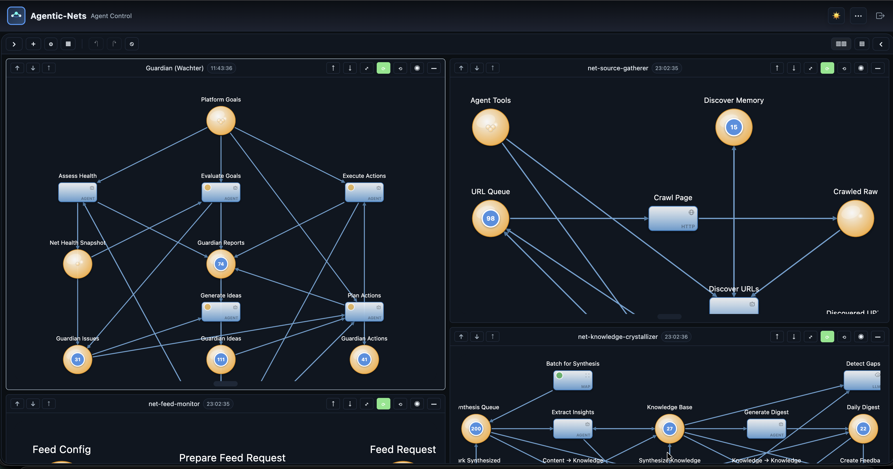
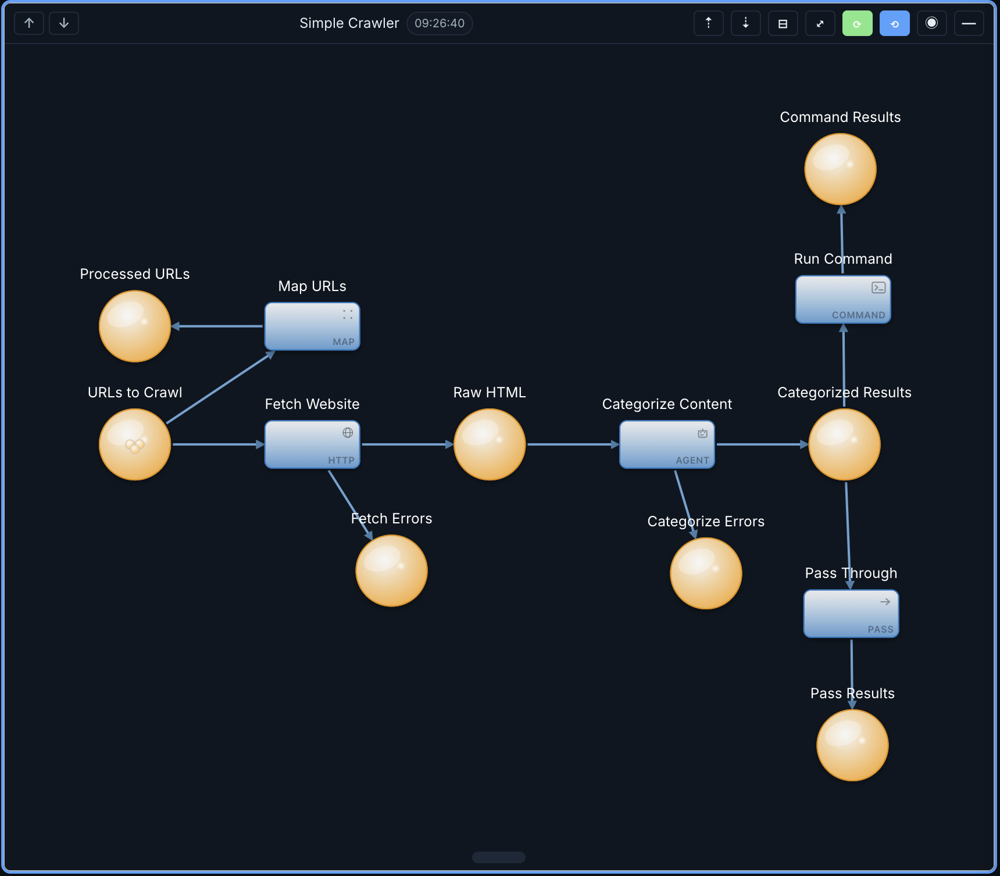

# Agentic-Nets


[](https://github.com/alexejsailer/agentic-nets/actions/workflows/ci.yml)
[](LICENSE.md)
[](https://agentic-nets.com)
[](https://forum.agentic-nets.com)

**Build AI systems you can see, stop, replay, and move.**

Agentic-Nets is a governed runtime for stateful, permission-scoped AI agents.
It puts agents, LLM calls, deterministic steps, tools, memory, approvals, and
remote execution into formal Petri nets. Places hold typed JSON state;
transitions do the work; every change leaves an event-sourced trail.

Use the visual Studio, an MCP client, the CLI, or the Claude Code plugin to
build one guarded agent, install a complete persona team, or coordinate a
network of long-running systems. The same runtime mixes server-hosted models,
local models, and client-supplied reasoning without hiding control flow in a
chat transcript.

## At a glance

| Question | Answer |
|---|---|
| What is it? | A Petri-net runtime for agents, tools, memory, remote execution, and audit trails. |
| Why does it exist? | To make agent systems inspectable, permission-scoped, replayable, and reusable instead of hidden inside chat state. |
| Can I use my own model? | Yes. Run server-side with Claude, OpenAI, or Ollama; host lanes from the CLI/MCP process; or let the connected MCP model execute selected AI transitions through external fires. |
| What is public in this repo? | Licensed public source for the gateway, executor, vault, CLI, chat bot, MCP server, blobstore, tool containers, deployment, and monitoring. |
| What is closed source? | The node, master, and Studio GUI runtime images used by the full stack. They ship from Docker Hub under the Proprietary EULA. |
| Current release | `v2.36.0`. Beta: suitable for evaluation, local experiments, and early adopters comfortable with a fast-moving stack. |

## The current platform in five points

1. **External execution / bring your own model.** Mark an `llm` or `agent`
   transition as external, or apply that policy to a net, session, or model.
   Master leaves it alone; an MCP client leases the exact prepared prompt,
   supplies the answer with its own model, and hands it back to the normal
   emit-and-consume pipeline.
2. **Installable agent teams.** Agent Hub currently ships five starting
   templates: Dev Crew, Research Analyst, Health Coach, Context Curator, and
   Crystallizer. Model profiles can compose the right resident agents and
   context systems automatically.
3. **NetHub packages whole systems.** Publish and install nine artifact kinds:
   nets, sessions, models, agent teams, context systems, tool nets, individual
   tools, catalogs, and blobs. Dependencies are bundled and credentials are
   scrubbed.
4. **Governance is enforced at runtime.** Ten positional capability flags
   (`rwxhludcts`), named capability profiles, tool allowlists, resource scopes,
   Vault-backed credentials, a fleet-wide LLM freeze, and an automatic spend
   breaker bound what an agent can do.
5. **One MCP server exposes the platform.** `@agenticnets/mcp` provides a focused
   curated workflow surface plus an optional native catalog used by in-net agents.
   Desktop Lite defaults to curated; server installs retain both for compatibility.


*One net, two execution locations: an external MCP agent hands structured
findings to a master-run LLM lane.*

[](https://www.youtube.com/watch?v=orI-u5YT7Go)

Watch the product preview on YouTube: [agentic-nets preview](https://www.youtube.com/watch?v=orI-u5YT7Go)

If prompt-based agents feel powerful but structurally weak, this is the missing
layer:

- **Agents live in nets.** Context is structured state, not a fragile chat session.
- **Nets talk to nets.** Teams, tools, approvals, memory, and pipelines become explicit handoffs.
- **Everything stays inspectable.** Tokens, tool calls, events, and emissions remain queryable and replayable.
- **The same model scales up.** Build one guarded developer agent or a whole product runtime with the same primitives.

## Start here

| Goal | Link |
|---|---|
| Fastest local creator/operator setup (no Docker) | [Desktop Lite](#desktop-lite-macos--linux--no-docker-or-server-llm) |
| Run the production-like Docker stack | [Install in 5 minutes](#install-in-5-minutes) |
| Bring your own model through MCP | [Connect over MCP](#or-connect-over-mcp--working-memory-agent-hub-and-external-execution) |
| Follow the release velocity | [CHANGELOG.md](CHANGELOG.md) and [release tags](https://github.com/alexejsailer/agentic-nets/tags) |
| See live systems already running on Agentic-Nets | [See it running in production](#see-it-running-in-production) |
| Watch the live `safe-teams` net | [Public read-only live demo](#public-read-only-live-demo) |
| Understand the core model | [What makes this different](#what-makes-this-different) and [ARCHITECTURE.md](ARCHITECTURE.md) |
| Read the whitepaper — the harness control system, complete domain automation | [docs/whitepaper/the-harness-control-system.html](docs/whitepaper/the-harness-control-system.html) ([view rendered](https://raw.githack.com/alexejsailer/agentic-nets/main/docs/whitepaper/the-harness-control-system.html)) |
| Drive a stack from Claude Code | [Drive it from Claude Code](#drive-it-from-claude-code) |
| Connect any MCP client | [MCP server](agentic-net-mcp/README.md) |
| Contribute to the public repo | [CONTRIBUTING.md](CONTRIBUTING.md) and [issues](https://github.com/alexejsailer/agentic-nets/issues) |
| Ask questions or discuss use cases | [GitHub Discussions](https://github.com/alexejsailer/agentic-nets/discussions) or [forum.agentic-nets.com](https://forum.agentic-nets.com) |
| Report a security issue | [SECURITY.md](SECURITY.md) |

> **Licensing note.** Agentic-Nets is a hybrid stack. Public components in this
> repository are licensed under BSL 1.1 and convert to Apache 2.0 on
> 2030-02-22. The orchestration core ships as closed-source Docker Hub images
> and desktop release assets under the Proprietary EULA. See
> [licensing](#licensing) before production use.

## Quick local run

This starts the lightweight local stack from Docker Hub. Use the longer install
section if you want monitoring, local public-service builds, Ollama cloud-model
login details, or troubleshooting notes.

```bash
git clone https://github.com/alexejsailer/agentic-nets.git
cd agentic-nets/deployment

cp .env.template .env
# Optional for master-run llm/agent lanes: choose one server provider.
# LLM_PROVIDER=claude + ANTHROPIC_API_KEY=...
# LLM_PROVIDER=openai + OPENAI_API_KEY=...
# LLM_PROVIDER=ollama for the bundled Ollama container
#
# You can instead leave AI lanes stopped/external and let a connected MCP
# model execute them. See "Connect over MCP" below.

docker compose -f docker-compose.hub-only.no-monitoring.yml up -d

cat data/gateway/jwt/admin-secret
open http://localhost:4200
```

## Desktop Lite (macOS + Windows + Linux) — no Docker or server LLM

This is the fastest local creator/operator setup: install one package, start the
tray app, connect Codex, Claude Code, or another MCP client, and create,
schedule, inspect, or execute nets. The connected MCP client supplies the
intelligence. The bundled master stays as the deterministic net/schedule/audit
runtime, but its server-side LLM is disabled by default. No Docker daemon, Java
or Node installation, API key, or Ollama process is required.

Desktop Lite is loopback-only and is not the recommended production
deployment. Use the Docker/server deployment for remote access, clustering,
monitoring, or production lifecycle controls.

**Download** from [Releases](https://github.com/alexejsailer/agentic-nets/releases)
and verify against `SHA256SUMS.txt`:

- **macOS**: `AgenticNetOS-<version>-macos-<arch>.dmg` — open, accept the
  license, drag to Applications. Current builds are unsigned, so macOS refuses
  the first open: right-click the app → "Open", or allow it under System
  Settings → Privacy & Security → "Open Anyway".
- **Debian/Ubuntu**: `sudo apt install ./AgenticNetOS-<version>-linux-<arch>.deb`,
  then run `/opt/agenticnetos/bin/AgenticNetOS`.
  On a server without a desktop it runs headless (no tray, same services).
- **Fedora/RHEL**: the matching `.rpm`.
- **Windows**: run `AgenticNetOS-<version>-windows-x64.msi`. Current builds are
  unsigned, so SmartScreen may warn on first run ("More info" then "Run anyway").
  Upgrades install over the old version in place; the msiexec-level upgrade path
  (previous release installed, data preserved, app serving afterwards) is tested
  in CI before every release.

**Build the installer yourself**: clone this repository and run
`agentic-net-desktop/scripts/build.sh` (macOS/Linux) or
`agentic-net-desktop\scripts\build-windows.ps1`. The primary requirements are a
JDK 21+ and Node.js 22; see the
[Desktop Lite guide](agentic-net-desktop/DESKTOP-LITE.md#build-an-installer-from-a-clone)
for the small platform packaging prerequisites. Closed node/master/GUI binaries
come from matching checksum-verified release assets, with Docker Hub images
only as a fallback.

**Then**: use "Connect Codex (copy config)" or "Connect Claude Code (copy
command)" in the tray. With no server-side LLM configured, master skips its AI
transitions rather than failing them, and the connected model runs them instead:
it reasons while master still owns token binding, emission, accounting and the
event trail. Data lives
in `~/.agenticos/` and survives updates. The bundled command executor is eligible
for every model and activates that model on demand after its first command lane,
so newly created domains need no executor configuration. Full
workflow and limitations: [Desktop Lite](agentic-net-desktop/DESKTOP-LITE.md).

**Updating**: quit the app, install the new package over the old one (macOS:
drag-replace in Applications; Debian/Ubuntu: `sudo apt install ./<new>.deb`),
relaunch. All data and settings live in `~/.agenticos/` and survive updates —
the app itself is stateless. The tray notifies you when a new release is out.

Everything binds to localhost by default. The bundled node, master and gui
binaries are covered by the [Proprietary EULA](PROPRIETARY-EULA.md); the rest
of the bundle is built from this repository under BSL 1.1.

## See it running in production

Not slideware — these are live systems, each one Agentic-Nets running a real
harness end to end:

- **[forum.agentic-nets.com](https://forum.agentic-nets.com)** — a real product forum. A feature request posted here is picked up by a virtual team net, triaged, built, tested, deployed, and reported back on the thread — automatically, with every lifecycle milestone posted as it happens.
- **[gitanalytics.agentic-nets.com](https://gitanalytics.agentic-nets.com)** — the actual product that team is building: a live git-commit-analytics service whose new endpoints are shipped by agents, not people.
- **The `safe-teams` net** — the virtual agile team that connects the two: PM, Architect, Developer, QA, DevOps, and RTE agents coordinating through a single net — intake → design → code (a real `command` transition runs the coding CLI on an executor) → QA gate → deploy → status. One harness turns a forum post into a shipped, verified feature.
- **[agentic-nets.com](https://agentic-nets.com)** — full documentation, the concept chapters, and the product tour.

## Public read-only live demo

You can open the live Studio in monitor mode and watch the `safe-teams` net
working without admin access:

1. Open [agentic-nets.com/#/monitor](https://agentic-nets.com/#/monitor).
2. Paste this public read-only demo token into the login form:

   ```text
   07a9af1d663f899f79f08ca56050a977d41472e34cc0dd0f74abe046446f78f9
   ```

3. Keep **Read-only access (no writes)** enabled and log in.

The monitor view is scoped to the `safe-teams` model. It lets guests inspect
the live net, token counts, event story, console, agenda, and current handoffs.
Read-only sessions cannot edit nets, fire transitions, deploy changes, or use
write-capable assistant personas.

You can still ask questions from the monitor. The chat is pinned to the
**Domain Expert (read-only)** persona, which can explain what is happening in
the visible system. The normal Universal Assistant, Workflow Builder, Persona,
and other write-capable personas are reserved for authenticated Studio use.

## What you can model with it

- Virtual developers with explicit permissions, memory, and execution boundaries.
- Virtual agile teams where planner, builder, reviewer, tester, and releaser agents coordinate through nets.
- Smart development tools that behave like reusable nets instead of throwaway prompts.
- Development pipelines that generate code, run checks, gate releases, and keep a durable audit trail.
- Product-level systems where backlog, QA, docs, incidents, and operations communicate as structured nets.
- Industry-specific operating models in software, finance, support, operations, research, healthcare, logistics, or any other domain that can be expressed as communicating nets.

## Who this is for

- Builders who want agents to operate inside explicit state machines instead of loose prompt loops.
- Teams that need remote execution, approvals, secrets, and audit trails around autonomous work.
- Product engineers turning one-off agent workflows into reusable internal systems.
- Researchers and tool builders exploring Petri nets as a runtime model for agent coordination.

## Probably not for you if

- You only need a one-off chat wrapper or a single scripted LLM call.
- You require every runtime component to be permissively licensed today.
- You need certified production software for regulated environments without doing your own validation.

## Net of nets

One net can contain one or many agents. Many nets can also work together as a
larger runtime: one can guard, one can gather, one can synthesize, one can
execute, and all of them can exchange structured state through explicit flows
instead of hidden prompt handoffs.



## Example net

This simple crawler net shows the model in practice: places hold the state,
`http` fetches, an `agent` transition categorizes content, a `command`
transition runs remote work through an executor, and `map` plus `pass`
transitions route results through the graph.



## How behavior is modeled

Agentic-Nets uses **seven transition types**: `pass`, `map`, `http`, `llm`,
`agent`, `command`, and `link`.

- **`agent` transitions are the core runtime primitive.** They can mimic almost any agent behavior or mode, but inside a governed net with explicit inputs, outputs, permissions, and memory boundaries.
- **`agent` transitions can also adapt the net itself.** If an agent has sufficient rights, it can read tokens in the net, create additional places and transitions, and extend the structure on demand instead of staying confined to a fixed graph.
- **`command` transitions connect the net to remote execution.** They define which executor can run a command remotely and bring the result back into the net as structured state.
- **Deterministic and non-deterministic transitions coexist.** Fixed logic can stay fixed, while open-ended reasoning stays open-ended, in the same runtime and on the same graph.
- **This is what makes the model powerful across domains.** A net can combine several cooperating agents with deterministic control flow, verification, remote execution, and cross-net communication.

## Everything a harness needs — assembled by prompting

A production agent **harness** is all the scaffolding *around* the model: the
tools it can call, the control flow between steps, the memory it keeps, where it
runs, who is allowed to do what, and how you see what happened afterwards. Most
teams hand-write that harness in code and re-write it for every new agent.
Agentic-Nets gives you every one of those pieces as a first-class primitive you
**build by describing it** — and each piece is inspectable, reusable, and
governed by default.

| A harness needs… | …you get it as (no code) |
|---|---|
| **Tools** | Reusable **tool nets**, digest-pinned Docker tools, HTTP services, executable scripts, and `http` / `command` transitions |
| **Control flow** | **Nets** wired from seven transition types — deterministic (`pass` / `map` / `http`) and AI (`llm` / `agent`) lanes on the same graph, with conditional routing and capacity gates |
| **Agents** | **`agent` transitions**, built-in assistant personas, and versioned **Agent Hub** teams installed as complete sessions |
| **Memory & state** | **Places + tokens**, typed context systems, and bounded context capsules queryable with **ArcQL** |
| **Execution** | Distributed **executors** that poll egress-only (firewall-friendly, deployable anywhere) and run scoped work in **Docker** |
| **Governance** | **`rwxhludcts` capability roles**, named profiles, tool allowlists, resource scopes, spend controls, and **Vault** secrets injected only at action time |
| **Observability** | **Event-sourced history** — replay the log, watch the live event-line, and ask what existed at any decision point |
| **Reuse & export** | Export **inscriptions / PNML** or use **NetHub** to move nets, sessions, models, agents, contexts, tools, catalogs, and blobs |
| **Self-extension** | **Builder / Forge** agents that create new places, transitions, and whole tool-nets *inside the running system* — the harness grows itself |

### Drive it your way — visual, conversational, or API-first

You are not tied to one model vendor or one interface.

**In the Studio (the GUI).** Watch every net, token, tool call, and event as it
happens, and set the whole thing up by clicking — create models, sessions, nets,
places, transitions, and inscriptions, deploy them, and adapt anything live. The
Studio ships **several built-in assistant agents** — a Universal Assistant front
door, a Workflow Builder that lays down and deploys whole nets from plain
language, a Persona specialist-builder, plus operator and domain-expert roles —
so you get the same *"just describe it"* power as an external coding agent, right
inside the product. The **Forge** meta-agent builds new reusable tool-nets on
demand.

**From Claude Code (remote).** The `agenticos-control` plugin (dedicated
net-designer and net-operator agents, a control skill, and slash commands) plus
Claude Code's **Remote Control** let you drive the entire system — build nets,
run pipelines, even cut a release — **from anywhere, including your phone**,
purely by chatting. See [Drive it from Claude Code](#drive-it-from-claude-code).

**Bring your own model.** Point the server at Claude, OpenAI, or a local
**Ollama** model; host selected lanes in the CLI/MCP process; or mark AI lanes
as external so the connected MCP model itself performs the reasoning. A single
net can mix master-run and externally executed transitions while retaining the
same state, emission, audit, and permission pipeline.

## The nine production gaps Agentic-Nets closes

1. **Invisible state.** Every intermediate value is a token in a typed place, queryable with ArcQL while the net runs.
2. **Vanishing memory.** Memory is structured state. Agents read and write lessons through places and `EMIT_MEMORY`.
3. **Weak observability.** State is event-sourced. Replay the log, inspect reductions, and ask what existed at decision time.
4. **No permission model.** The `rwxhludcts` role ceiling, capability profiles, allowlists, and scopes gate tools at dispatch, not only in the prompt.
5. **Secrets in the wrong place.** Vault keeps credentials outside tokens and events, scoped per transition and injected only at action time.
6. **Unsafe execution boundary.** Remote executors poll over egress-only links; command work runs in scoped Docker tool containers.
7. **Hard to explain why.** Tool calls, results, emissions, and event trails keep provenance attached to the actual work.
8. **Poor reusability.** NetHub packages nine artifact kinds, their referenced dependencies, and an explicit token policy for installation elsewhere.
9. **No reflexive model.** Builder agents can create nets, places, arcs, transitions, and inscriptions inside the same runtime.

## Why this matters for coding agents

Most coding agents disappear after they ship code. The prompt is gone, the
checks are ad hoc, and the verification logic is not part of the product.

Agentic-Nets lets an agent do more than implement a feature. It can also create
the surrounding operating structure: unit tests, integration tests, and even a
dedicated verification net that stays in the system and can be reused against
future changes. That turns one-off AI output into durable runtime structure and
addresses some of the biggest weaknesses of coding agents: weak handoffs,
fragile memory, and missing long-term verification.

**Full docs and install chapter:** [agentic-nets.com](https://agentic-nets.com) *(see also the [Install chapter in-repo](#install-in-5-minutes))*.

> **BETA — USE AT YOUR OWN RISK.** In active development; may contain bugs,
> incomplete features, and breaking changes. No warranty. See
> [LICENSE.md](LICENSE.md) and [PROPRIETARY-EULA.md](PROPRIETARY-EULA.md).

## What's public, what's closed, and who can use it

Agentic-Nets ships as a **hybrid stack** — licensed public components in this
repo plus closed-source core binaries distributed as Docker Hub images and
desktop release assets. Read this before deploying.

| Layer | What | License | Who can use it |
|---|---|---|---|
| **Public components** (source in this repo) | `agentic-net-gateway`, `agentic-net-executor`, `agentic-net-vault`, `agentic-net-cli`, `agentic-net-chat`, `agentic-net-mcp`, `sa-blobstore`, `agentic-net-tools/`, `deployment/`, `monitoring/` | [BSL 1.1](LICENSE.md) | Free for development, testing, personal, educational, and evaluation use. **Commercial production use requires a commercial license.** Converts to Apache 2.0 on 2030-02-22. |
| **Closed source** (Docker Hub images + desktop release assets; no source in this repo) | `agentic-net-node`, `agentic-net-master`, `agentic-net-gui` | [Proprietary EULA](PROPRIETARY-EULA.md) | Free for personal, educational, evaluation, and non-commercial use. **Commercial use requires contacting [alexejsailer@gmail.com](mailto:alexejsailer@gmail.com).** |

Both licenses include a strong **NO WARRANTY / BETA** disclaimer. Nothing here is certified for regulated environments out of the box — you are responsible for your own risk assessment. If you are unsure whether your intended use counts as commercial production, **ask before deploying**.

---

## Problem it solves

Prompts with tools get you started. Production agent systems need more than
that: durable state, bounded permissions, visible handoffs, scoped execution,
secret management, and a way to replay what happened after the chat has gone
away.

Most agent frameworks solve the *"how do I call an LLM"* problem and leave the
operating model to application code. Agentic-Nets makes that operating model
explicit: agents read tokens from places, write tokens to places, call only the
tools their role permits, and leave an event trail behind.

---

## Install in 5 minutes

You need Docker Desktop or Docker Engine with Compose v2. A server-side LLM
backend is required only for AI lanes that master executes: choose Claude,
OpenAI, or Ollama. External lanes can instead use the model in a connected MCP
client, with no server API key. You do **not** need Java, Node.js, or Maven
unless you want to build services from source.

Apple Silicon Macs can run the current Docker Hub images through Docker
Desktop's `linux/amd64` emulation. Docker may print platform-mismatch warnings
on first start; that is expected unless multi-arch images have been published
for your release.

```bash
# 1. Clone the public repo
git clone https://github.com/alexejsailer/agentic-nets.git
cd agentic-nets/deployment

# 2. Create your env file
cp .env.template .env

# 3. Optional: configure ONE provider for master-run llm/agent lanes:
#    Claude: LLM_PROVIDER=claude + ANTHROPIC_API_KEY=sk-ant-...
#    Ollama: LLM_PROVIDER=ollama (bundled container — no host install required).
#            Default model: deepseek-v4-pro:cloud (routes through ollama.com,
#            requires a one-time login — see step 5). To run fully offline instead,
#            set OLLAMA_MODEL (and the HIGH/MEDIUM/LOW tiers) to a local tag
#            like llama3.2 before starting the stack.
#    OpenAI: LLM_PROVIDER=openai + OPENAI_API_KEY=sk-...

# 4A. Start the full stack with monitoring
docker compose -f docker-compose.hub-only.yml up -d

# 4B. Or start the lighter stack without Grafana/Prometheus/Tempo
# docker compose -f docker-compose.hub-only.no-monitoring.yml up -d

# If startup says port 5001 is already allocated, edit .env and set:
# AGENTICNETOS_REGISTRY_PORT=5002
# Then rerun the same docker compose command.

# 5. If you chose Ollama, authenticate or pull the model into the bundled container:
#    (a) Default cloud model — one-time interactive login (see note below):
docker exec -it agenticnetos-ollama ollama signin
#    (b) OR, if you switched to a local model (e.g. llama3.2), pull it instead:
# docker exec agenticnetos-ollama ollama pull llama3.2

# 6. Optional: seed approved Docker tool images into the local registry.
#    Agents use these for crawler/RSS/search/Reddit/API helper containers.
docker compose -f docker-compose.hub-only.yml --profile tools run --rm agenticos-tool-seeder

# 7. Grab the admin secret the Studio login page asks for.
#    The gateway auto-generates it on first startup and bind-mounts it onto
#    the host — read it from the host (NOT from inside the container):
cat data/gateway/jwt/admin-secret

# 8. Open the Studio GUI and paste the secret into the login page
open http://localhost:4200
```

> **Where does the admin secret come from?**
> `agentic-net-gateway` writes a random admin secret to
> `deployment/data/gateway/jwt/admin-secret` on its first start. Read that
> file on the host and paste the value into the Studio login page (tick
> *Read-only access* if you want a read-only JWT — same secret, the gateway
> mints a scoped token). CLI, chat, and executor mount the same file
> read-only and auto-acquire their JWTs, so you don't need to configure them.
> If you prefer a pinned value, set `AGENTICOS_ADMIN_SECRET=<long-random-string>`
> in `.env` before `docker compose up -d` — that string then becomes the
> login secret.

> **Where does the Ollama login token come from?**
> `ollama signin` is a one-time pairing: it prints a URL + device code to the
> container logs, you open that URL in a browser, sign in to your
> [ollama.com](https://ollama.com) account, and approve the device. No token
> file to manage — credentials are stored inside the container at
> `/root/.ollama/` and survive restarts (the `ollama-data` volume).
> If you prefer non-interactive auth, generate an API key at
> [ollama.com/settings/keys](https://ollama.com/settings/keys) and pass it:
> `docker exec agenticnetos-ollama ollama signin <your-api-key>`.
> Cloud-suffixed models (`:cloud`, `:671b-cloud`, etc.) route through
> ollama.com and can be rate-limited during long sessions — swap to a local
> tag if you hit `429` errors.

**You don't write any code for the first run.** Open the Universal Assistant in
the Studio and ask *"Help me build my first net."* For write operations, switch
to or invoke the Workflow Builder persona. It can create places, transitions,
arcs, inscriptions, and deploy the result in the active model/session.

Prefer to use the model already connected to your MCP client? Start the stack,
connect `@agenticnets/mcp`, and use `set_external` on one transition or at net,
session, or model scope. `list_external_fires` shows which lanes are ready;
`prepare_external_fire` and `complete_external_fire` execute the work through
the connected model while master retains token binding, emissions, accounting,
and the audit trail.

### Compose choices

| File | What it starts | Use it when |
|---|---|---|
| `deployment/docker-compose.hub-only.yml` | Complete local stack from Docker Hub, including monitoring | You want the production-like local setup |
| `deployment/docker-compose.hub-only.no-monitoring.yml` | Complete runtime stack from Docker Hub, no monitoring | You want a lighter laptop setup |
| `deployment/docker-compose.yml` | Closed-source core images from Docker Hub + public services built locally | You are developing this repo |

The `.env.template` is fully commented. The most important variables are:

| Variable | Purpose |
|---|---|
| `AGENTICNETOS_VERSION` | Docker Hub image tag. Release CI pins this. |
| `AGENTICNETOS_BIND_ADDRESS` | Defaults to `127.0.0.1` so published ports stay local. |
| `LLM_PROVIDER` | `ollama`, `claude`, `openai`, `claude-code`, or `codex`. |
| `ANTHROPIC_API_KEY`, `OPENAI_API_KEY` | Required only for those hosted providers. |
| `OLLAMA_BASE_URL`, `OLLAMA_MODEL` | Required for local Ollama. |
| `OPENBAO_DEV_ROOT_TOKEN` | Local Vault token. Change before exposing the stack. |
| `AGENTICNETOS_NODE_DATA_DIR` | Host directory for Node events and snapshots. |
| `MASTER_OTEL_TRACES_EXPORTER` | Master traces are **off by default** (`none`) so its chatty poll loop can't flood Tempo. Set to `otlp` for end-to-end master→node tracing. Node always traces; master metrics always reach Prometheus. |

Detailed install, env, verification, and troubleshooting:
[deployment/README.md](deployment/README.md).

---

## Observability — metrics, traces, and logs

The monitoring stack (started by `docker-compose.hub-only.yml`, or the standalone
`monitoring/docker-compose.yml`; omitted by the `no-monitoring` compose) gives you three
signals, all viewable in **Grafana** at `http://localhost:3000` (`admin`/`admin`):

| Signal | Backend | How it gets there |
|---|---|---|
| **Metrics** | Prometheus (`:9090`) | Each service exposes `/actuator/prometheus`; Prometheus scrapes it. Always on. |
| **Traces** | Tempo (`:3200`) | Services export OTLP to the OpenTelemetry Collector (`:4318`), which forwards to Tempo. |
| **Logs** | Loki (`:3100`) | Grafana Alloy tails every container's stdout and pushes to Loki. |

### Logging

Every service logs to **stdout** — so `docker logs <container>` (and Docker Desktop's log
view) shows the live application log — **and** to a **rolling file** under
`deployment/data/logs/<service>/`. All Java services share one logback configuration:

- **Pattern:** `yyyy-MM-dd HH:mm:ss.SSS [thread] LEVEL logger [trace_id,span_id] - msg`
  (the `trace_id` links a log line to its Tempo trace when tracing is on).
- **Rollover:** 50 MB per file, 7 daily archives, 500 MB total cap, gzip-compressed — bounded
  by default. Tune per service with the standard Spring properties
  `logging.logback.rollingpolicy.max-file-size` / `.max-history` / `.total-size-cap`.
- **File path:** `${LOG_PATH:-/tmp}/<service>.log`; compose sets `LOG_PATH=/app/logs` and
  bind-mounts it to the host.

The Node/TS services (CLI, chat, MCP) print the same timestamped `LEVEL` format; diagnostics
go to **stderr** (the CLI keeps stdout clean for command output, and the MCP server reserves
stdout for the protocol), so Docker captures them without disturbing the wire format.

**Centralized query.** With the monitoring stack up, **Grafana Alloy** discovers every
container via the Docker socket (mounted read-only — no application change) and ships stdout to
**Loki**. In Grafana → Explore, pick the **Loki** datasource and query by label, e.g.
`{container="agenticnetos-master"}` or `{service="gateway"}`. Loki is **hard-capped** out of the
box (72 h retention, 5 MB/s ingest — see `monitoring/config/loki.yaml`) so it can't fill the
disk. Loki listens on `:3100`; set `LOKI_PORT` to remap.

### Tempo (distributed tracing)

Traces answer *"what did this request touch, and where did the time go"* across the
executor → gateway → master → node hops. The flow is:

```
service (OTLP) ──▶ otel-collector :4318 ──▶ Tempo :3200 ──▶ Grafana (TraceQL / trace view)
```

Query traces in Grafana → Explore → **Tempo** datasource (TraceQL, or search by service/
duration). Because a log line carries its `trace_id`, you can pivot straight from a Loki log to
the matching Tempo trace.

Two deliberate defaults keep tracing from overwhelming a laptop or the staging box:

- **Master tracing is OFF by default.** The master polls every transition every 2 s, which is by
  far the chattiest span source. Set `MASTER_OTEL_TRACES_EXPORTER=otlp` to turn on end-to-end
  master→node tracing. The **node always traces**, and **master metrics always reach
  Prometheus** regardless.
- **Tempo is capped** (`monitoring/config/tempo.yaml`): 24 h block retention and a 5 MB/s
  ingestion rate limit (10 MB burst, 5 MB max per trace). These caps exist because an uncapped
  Tempo once spiraled to multi-core CPU and hundreds of GB on staging — raise them deliberately,
  not by accident.

---

## Drive it from Claude Code

The [`agenticos-control`](claude-plugin/agenticos-control) **Claude Code plugin** turns any Claude Code
session into a full control surface for a running stack: inspect nets, read and edit places and tokens, call
the designtime and runtime REST APIs, fire and diagnose transitions, author nets, drive the Universal
Assistant / Persona / Forge personas, and export net diagrams. It is **CLI-first** (it uses the `agenticos`
CLI when it is installed) with a **curl fallback**, and works both **locally** (direct to the services) and
**remotely** (through the gateway's OAuth2, so you can drive the whole thing from anywhere, even your phone).

**Install it.** From any Claude Code session:

```
/plugin marketplace add alexejsailer/agentic-nets
/plugin install agenticos-control@agentic-nets
```

(Working from a local clone instead? `/plugin marketplace add ./agentic-nets`.)

**Point it at your stack.** The plugin auto-detects gateway mode when a secret is present, otherwise direct
mode. For the local Docker stack (whose gateway is published on `127.0.0.1:8083`), reuse the same admin
secret the Studio login uses:

```bash
export AGENTICOS_GATEWAY_URL=http://localhost:8083
export AGENTICOS_GATEWAY_SECRET_FILE=deployment/data/gateway/jwt/admin-secret
```

For a same-network setup where master and node are reachable directly, set
`AGENTICOS_MASTER=http://localhost:8082` and `AGENTICOS_NODE=http://localhost:8080` and leave the secret
unset. Secrets are read only from an env var or a file, the JWT stays in-process, and nothing is ever printed
or written to disk.

**Use it.** The plugin ships a skill, two agents (`agenticos-net-designer`, `agenticos-net-operator`), and
slash commands:

| Command | What it does |
|---|---|
| `/agenticos-doctor` | Preflight the connection (resolved mode/auth/targets + reachability, no secrets) |
| `/agenticos-inspect <modelId> [sessionId] [netId]` | Snapshot transitions and states, a session's nets, a net's places and live token counts |
| `/agenticos-fire <modelId> <transitionId>` | Fire a transition once (handles the stop/fire/start dance) |
| `/agenticos-persona <universal\|persona\|...> <modelId> "<prompt>"` | Drive a persona and stream its reply |
| `/agenticos-forge <modelId> "<intent>"` | Build a reusable tool-net from a plain-language intent |
| `/agenticos-export <modelId> <sessionId> <netId>` | Export a net to JSON or PNML (then render a diagram) |

Or just describe what you want: the skill routes structural work to the designer agent and diagnosis to the
operator agent. Full details, the REST/API reference, and the environment-variable table are in the plugin's
own [README](claude-plugin/agenticos-control/README.md).

### Or connect over MCP — working memory, Agent Hub, and external execution

The [`agentic-net-mcp`](agentic-net-mcp) server exposes a running stack to **any
MCP client** (Claude Code, Claude Desktop, Cursor, or your own agent framework)
over the [Model Context Protocol](https://modelcontextprotocol.io). The client
gets persistent working memory, a complete net workbench, Agent Hub and NetHub
operations, and governed execution tools through one protocol.

- **164 tools in the default read-write surface.** Start with 54 curated
  lowercase tools for common workflows, or drop to 110 native uppercase tools
  generated from the same catalog used by agent transitions inside the
  runtime.
- **Memory that runs.** `memory_write` / `memory_recall` use event-sourced
  places, and scheduled server-side transitions can distill raw captures into
  durable notes after the client disconnects.
- **Build and operate full systems.** Create models with standard, research,
  knowledge, or development profiles; install Agent Hub teams and context
  systems; publish or install NetHub packages; build nets; inspect live state;
  and diagnose transitions without shell access to the host.
- **Two client-side execution paths.** `host_transition` runs an unattended
  local provider loop. External fires instead let the connected model itself
  reason: `list_external_fires`, `set_external`,
  `prepare_external_fire`, `complete_external_fire`, and
  `abandon_external_fire` preserve master's normal binding, emission,
  accounting, permission, and idempotency rules.
- **Controls that survive prompt injection.** A model allowlist, readonly mode,
  capability profiles, per-fire tool grants and resource scopes, model pause,
  fleet-wide LLM freeze, and spend reporting are enforced by the runtime and
  gateway rather than merely described in a system prompt.

```bash
claude mcp add agenticnets \
  -e AGENTICOS_GATEWAY_URL=http://localhost:8083 \
  -e AGENTICOS_GATEWAY_SECRET_FILE="$PWD/data/gateway/jwt/admin-secret" \
  -e AGENTICOS_MODELS=my-memory \
  -- npx @agenticnets/mcp
```

Run that command from `deployment/` after starting the stack. Then tell your
assistant to *"set up my working memory"*, *"install the development profile"*,
or *"make the AI transitions in this session external."* The full tool list,
configuration, templates, hooks, and security model are in the server's own
[README](agentic-net-mcp/README.md).

---

## Release Notes

The active [`CHANGELOG.md`](CHANGELOG.md) tracks the **current calendar
quarter**. Older quarters are archived under
[`changelogs/`](changelogs/) ([index](changelogs/README.md)).

Agentic-Nets is a fast-moving beta. Between July 3 and July 25, 2026, the
public repository recorded 23 version tags across 16 release days. Tags are
not all equal in size, so the changelog, tests, and live demo are the useful
evidence behind the cadence:

| Release | Platform milestone |
|---|---|
| `v2.33.0` | Installable Agent Hub teams |
| `v2.34.0` | Context systems, typed relations, and semantic navigation |
| `v2.35.0` | Shared capability profiles and bounded context capsules across master and client hosts |
| `v2.36.0` | External fires, fleet-wide LLM freeze, and spend-breaker controls |

| Quarter | Highlights |
|---|---|
| **2026 Q3 (current)** | [`CHANGELOG.md`](CHANGELOG.md) |
| 2026 Q2 | Gateway/vault maturation, tool-net library + Forge, capability flags, `glm-5.2:cloud` default — [archive](changelogs/CHANGELOG-2026-Q2.md) |
| 2026 Q1 | First releases (`v1.6.0` → `v1.19.0`), repo split, `v1.2.0` launch — [archive](changelogs/CHANGELOG-2026-Q1.md) |
| 2025 Q4 | Pre-release: distributed execution, agent transitions, outbound-only architecture, designtime API — [archive](changelogs/CHANGELOG-2025-Q4.md) |
| 2025 Q3 | Pre-release: project foundations, multi-model architecture, NL→PNML, GUI editor — [archive](changelogs/CHANGELOG-2025-Q3.md) |

---

## What makes this different

|  | Prompt-with-tools frameworks | Agentic-Nets |
|---|---|---|
| **What can this agent see?** | Whatever you paste into context | Only the tokens in its inbound places |
| **What can this agent do?** | Whatever tools you register | Only tools allowed by its `rwxhludcts` role ceiling, capability profile, allowlist, and resource scopes |
| **Where do its outputs go?** | Back to you, mixed with reasoning | Typed tokens in declared outbound places |
| **What did it actually do?** | Chat transcript | Token trail with full provenance |
| **How does it get cheaper?** | It doesn't | Crystallization — agent steps collapse into deterministic transitions |
| **Where does the model run?** | Usually wherever the framework is hosted | On master, in a local transition host, or in the connected MCP client, selectable down to one AI lane |

The graph gives hallucination less room to become uncontrolled action: inputs,
permissions, and outputs are explicit.

---

## Architecture

```
    CLIENTS AND WORKERS  (all authenticate via gateway-minted JWT)
  +--------------+  +--------------+  +--------------+  +---------------+
  | agentic-net  |  | agentic-net  |  | agentic-net  |  | agentic-net   |
  | gui (4200)   |  | cli          |  | chat         |  | executor      |
  | Closed core  |  | Public src   |  | (Telegram)   |  |  (8084)       |
  |              |  | + MCP        |  | Public src   |  | Public src    |
  +------+-------+  +------+-------+  +------+-------+  +------+--------+
         |                 |                 |                 |
         | JWT             | JWT             | JWT             | JWT *
         |                 |                 |                 |
         +-----------------+--------+--------+-----------------+
                                    |
                                    | (all client traffic funnels
                                    |  through the gateway;
                                    |  tokens minted from the
                                    |  admin secret auto-generated
                                    |  on first startup at
                                    |  data/gateway/jwt/admin-secret
                                    |  and mounted read-only by
                                    |  cli, chat, executor)
                                    v
                         +-------------------+
                         | agentic-net-      |   Public source (BSL 1.1)
                         | gateway (8083)    |   OAuth2 + JWT router
                         +---+------------+--+
                             |            |
                +------------v+         +-v---------------+
                | agentic-net |         | agentic-net     |   Closed source (Hub / desktop)
                | master      |<------->| node            |   orchestration + state engine
                |  (8082)     |         |  (8080)         |
                +--+--------+-+         +-----------------+
                   |        |
                   |        |   BACKEND SERVICES
                   |        |   (master-internal,
                   |        |    not client-exposed)
                   |        |
          +--------v--+  +--v-----------+
          | agentic-  |  | sa-blobstore |   Public source (BSL 1.1)
          | net-vault |  |  (8090)      |   backend data tier
          |  (8085)   |  | large tokens |
          | secrets   |  | + knowledge  |
          +-----------+  +--------------+

  * Executor supports dual-mode polling: JWT via gateway (shown above, works
    across firewalls) OR direct to master on the same compose network.
```

### Agent roles on the wire

Every agent runs under the positional **capability role** `rwxhludcts`. The
role is the coarse ceiling; a named capability profile, an explicit tool
allowlist, and resource scopes can narrow it for a particular fire.

| Flag | Capability | Examples |
|---|---|---|
| `r` | Read | Inspect nets, places, tokens, models, contexts, and package metadata |
| `w` | Write | Create tokens and structure; author, register, or promote tool nets |
| `x` | Execute | Deploy, start, stop, fire, and run transitions |
| `h` | HTTP | Call and register external HTTP services |
| `l` | Logs | Query events, facets, and fire trails |
| `u` | Inhabit | Await tokens and use fire-and-wait interaction patterns |
| `d` | Docker | Discover, validate, run, stop, and inspect container tools |
| `c` | Coordinate | Invoke personas, delegate tasks, and collect results |
| `t` | Tool nets | Discover, inspect, and invoke reusable capability nets |
| `s` | Scripts | Register executable script artifacts in the tool catalog |

A role-less agent defaults to lean read/write access, not full power. The
runtime refuses calls outside the effective grant.

### Executor polling modes

Executor agents use **egress-only polling** — firewall-friendly, deployable
anywhere:

| Mode | When | Executor polls | Auth |
|------|------|----------------|------|
| **Direct** | Same network as master | `http://agentic-net-master:8082` | None (internal) |
| **Gateway** | Remote / different network | `http://<gateway-host>:8083` | JWT (auto-acquired) |

### Public services (this repo)

| Service | Purpose | Port |
|---------|---------|------|
| **agentic-net-gateway** | OAuth2 API gateway with JWT auth, rate limits, read-only scopes | 8083 |
| **agentic-net-executor** | Distributed command execution agent, polls master direct or via gateway | 8084 |
| **agentic-net-vault** | Secrets management (OpenBao wrapper) for agent-transition credentials | 8085 |
| **agentic-net-cli** | Command-line agent with multi-provider LLM routing and tool-catalog sync | — |
| **agentic-net-chat** | Telegram-facing agent with streaming tool-call batches and `/verbose` toggle | — |
| **agentic-net-mcp** | MCP server: working memory, net workbench, Agent Hub/NetHub, and external execution | stdio / 8091 |
| **sa-blobstore** | Distributed blob storage for large tokens, artifacts, and knowledge content | 8090 |
| **agentic-net-tools/** | Tool containers agents start on demand (crawler, echo, reddit, rss, search, secured-api) | dynamic |

Docker tools are published as `alexejsailer/agenticos-tool-*:<version>` and mirrored into the bundled local registry (`localhost:5001`) by `agenticos-tool-seeder`. Master only runs images matching the local allowlist, normally `localhost:5001/agenticos-*`.

### Closed-source services (Docker Hub)

| Image | Purpose | Port |
|-------|---------|------|
| `alexejsailer/agenticnetos-node` | Event-sourced state engine, tree-structured persistence, ArcQL queries | 8080 |
| `alexejsailer/agenticnetos-master` | Orchestration, LLM integration, transition engine, agent runtime | 8082 |
| `alexejsailer/agenticnetos-gui` | Angular visual editor with drag-drop Petri-net design | 4200 |

These images are governed by the [Proprietary EULA](PROPRIETARY-EULA.md).

Full architecture deep dive: see [ARCHITECTURE.md](ARCHITECTURE.md).
Long-form whitepaper — *The Harness Control System: Complete Domain Automation on Agentic-Nets* (concepts, control loop, use cases, live evidence): [docs/whitepaper/the-harness-control-system.html](docs/whitepaper/the-harness-control-system.html) — a self-contained HTML document; download and open in any browser, or [view it rendered](https://raw.githack.com/alexejsailer/agentic-nets/main/docs/whitepaper/the-harness-control-system.html).

---

## Repository structure

```
agentic-nets/
├── LICENSE.md                    # BSL 1.1 for public code in this repo
├── PROPRIETARY-EULA.md           # EULA for Docker Hub images
├── README.md                     # (this file)
├── ARCHITECTURE.md               # Deep dive: transitions, ArcQL, coordination
├── CHANGELOG.md                  # Human-curated release notes
├── CONTRIBUTING.md               # How to contribute
│
├── docs/
│   ├── foundations/              # Figures from the 2012 KIT diploma thesis (see FOUNDATIONS.md)
│   └── whitepaper/               # The Harness Control System — self-contained HTML whitepaper
│
├── agentic-net-gateway/          # OAuth2 API gateway (Spring Boot)
├── agentic-net-executor/         # Command executor (Spring Boot)
├── agentic-net-vault/            # Secrets wrapper for OpenBao (Spring Boot)
├── agentic-net-cli/              # CLI agent (TypeScript/Node)
├── agentic-net-chat/             # Telegram-facing agent (TypeScript/Node)
├── agentic-net-mcp/              # MCP server and external-fire client surface
├── sa-blobstore/                 # Distributed blob storage (Spring Boot)
├── agentic-net-tools/            # Tool containers (Docker)
│
├── deployment/
│   ├── README.md                 # Local Docker Compose install guide
│   ├── docker-compose.yml        # Hybrid: Hub images + local builds
│   ├── docker-compose.hub-only.yml  # All services from Docker Hub + monitoring
│   ├── docker-compose.hub-only.no-monitoring.yml  # Runtime stack without monitoring
│   ├── .env.template             # Environment config template
│   ├── dockerfiles/              # Build files for public services
│   └── scripts/
│       ├── build-and-push.sh     # Build & push public service images
│       └── seed-tool-registry.sh # Mirror/build Docker tools into local registry
│
└── monitoring/
    ├── config/                   # OTel, Prometheus, Tempo, Loki, Alloy configs
    └── grafana-provisioning/     # Dashboards and datasources (Prometheus, Tempo, Loki)
```

---

## Licensing

Dual-license model:

- **Public code in this repo** — [BSL 1.1](LICENSE.md). Free for development,
  testing, personal, educational, and evaluation use. Commercial production use
  requires a commercial license. Converts to Apache 2.0 on 2030-02-22.
- **Closed-source Docker Hub images** (`agenticnetos-node`, `agenticnetos-master`,
  `agenticnetos-gui`) — [Proprietary EULA](PROPRIETARY-EULA.md). Free for
  personal, educational, evaluation, non-commercial use. Commercial use
  requires contact at alexejsailer@gmail.com.

**ALL SOFTWARE IS PROVIDED AS-IS WITH ABSOLUTELY NO WARRANTY.**

---

## Contact

- **Commercial licensing**: alexejsailer@gmail.com
- **Website & blog**: https://alexejsailer.com
- **Hosted docs**: https://agentic-nets.com
- **Video walkthroughs (YouTube)**: [Agentic-Nets playlist](https://www.youtube.com/playlist?list=PLW1ujxCEmjT0h9JgrUbMuxM2Pv2gsWnFb)
- **Issues**: https://github.com/alexejsailer/agentic-nets/issues
- **Contributing**: see [CONTRIBUTING.md](CONTRIBUTING.md)

---

> _Agentic-Nets is currently designed and maintained by Alexej Sailer as a
> one-person product effort, amplified by AI pair programming and an automated
> release pipeline. The product is therefore also a live test of its own
> premise: agents can increase delivery speed when their state, permissions,
> execution, and verification are made explicit. See
> [CHANGELOG.md](CHANGELOG.md) for the human-curated evidence._

Copyright (c) 2025-2026 Alexej Sailer. All rights reserved.
