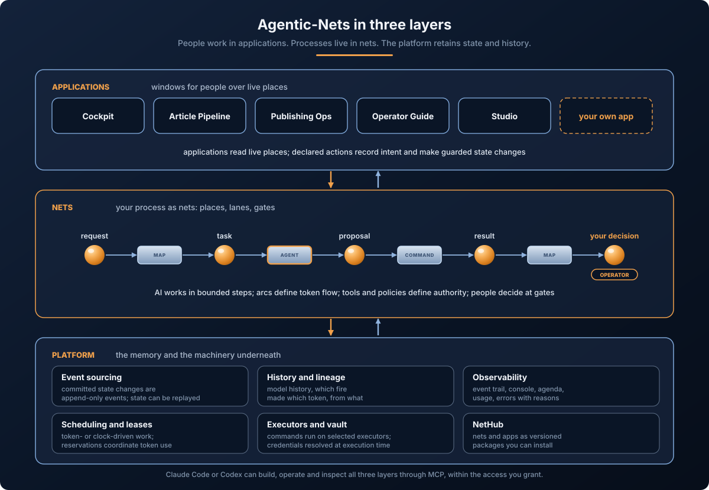
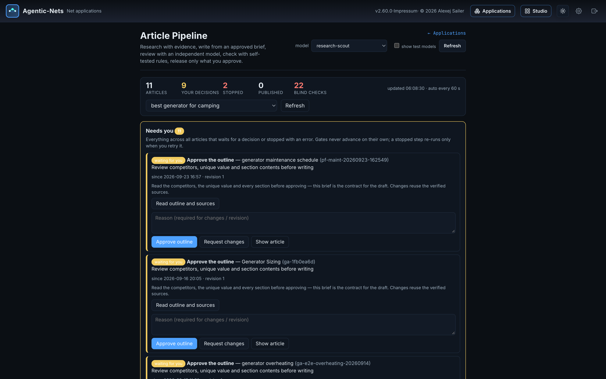
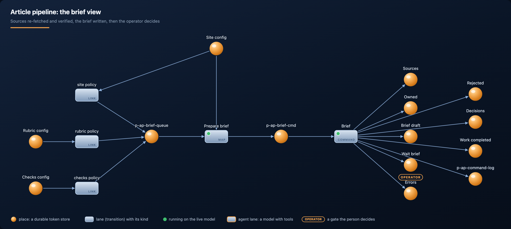

# Agentic-Nets


[](https://github.com/alexejsailer/agentic-nets/actions/workflows/ci.yml)
[](LICENSE.md)
[](https://github.com/alexejsailer/agentic-nets/releases/latest)
[](https://agentic-nets.com)
[](https://forum.agentic-nets.com)

**Turn a process you describe into a system you can run, inspect, and improve.**

Agentic-Nets is a runtime for persistent processes where **AI agents, automation,
and people work together**. Build a software team, a research desk, or an
operations process with visible work, durable context, and explicit decisions.
The process lives in executable **nets**; people work through **applications**;
the **runtime platform** manages execution, permissions, state, and history.

You can describe the process to Claude Code or Codex through MCP, or build it
visually in Studio. When an individual task ends, the team, its context, and its
open work can stay in place for the next one.

**[See a live example—no install or login](https://agentic-nets.com/#/shared-net/f2663810-bcce-4ed2-9507-40f77b3be04c)** ·
**[Download Desktop Lite](https://github.com/alexejsailer/agentic-nets/releases/latest)** ·
**[Watch the guided tour](https://youtu.be/hgW11A_7vWY)** ·
**[Read the documentation](docs/README.md)**

## What can it solve?

Agentic-Nets fits work that has several steps, needs judgment in some of them,
and must remain understandable when it stops for a decision or fails.

| Process | What you can put in a net |
|---|---|
| **Software delivery** | Request → specification → coding agent → tests → review → human merge decision |
| **Research and website operations** | Find demand → collect evidence → approve a brief → draft → independent review → release decision |
| **Incident response** | Alert → collect diagnostics → investigate → propose a fix → approval → apply → verify |
| **Support and review** | Intake → gather context → classify or assess → draft a response → approve or escalate |

Software delivery and website operations are demonstrated below. Incident
response and support are patterns you can build with the same primitives.
You supply the domain knowledge, integrations, and rules for success.

The practical benefit is being able to answer: **Where is the work? What
happened? Why did it stop? What needs me?** Work and decisions live in shared
state that people, agents, and deterministic steps can inspect and continue.

## Three layers, one shared state

**Applications show the work. Nets define the process. The platform runs it
and keeps its state.**

[](.github/images/agentic-nets-three-layers.svg)

### 1. Applications: where people work

A **Net Application** is a window onto a running process: a board, a review
screen, a research desk, or a cockpit showing what needs your attention.
It reads live places and offers declared actions such as **Approve brief**,
**Request changes**, or **Retry**.

An action records intent in the runtime and can make guarded state updates or
queue work. The net performs the execution. Applications and agents use the
same underlying state, so the decision you make on screen becomes part of the
process and its history.

Kanban, Goals, Interview, Protocol, and Approval Room provide starting points.
You can also build a purpose-specific application and package it with its nets.
**Studio** is the visual editor and inspection surface for the graph itself.

### 2. Nets: how the process works

A net is an executable graph based on **Petri nets**. You only need four ideas
to read one:

| Element | Meaning | Example |
|---|---|---|
| **Place** | A named, persistent container of state | Inbox, Evidence, Awaiting approval |
| **Token** | A structured JSON record in a place | A request, a source, a draft, a decision |
| **Transition**, also called a lane | One step that reads inputs and produces results | Fetch sources, run tests, ask an agent |
| **Arc** | A declared connection between places and transitions | Which inputs a step needs and where its results go |

Transitions react when their input conditions are met; schedules can trigger
work on a clock. Independent lanes can work in parallel, while shared places
connect specialists, tools, and larger processes.

A human gate is represented in state: a step records a proposal and finishes;
the next step requires the corresponding approval. The decision can wait in a
place while other work continues.

A **persona** adds a named responsibility, inbox, durable context, and scoped
tools to this structure. Several personas can form a team. A runtime **model**
groups related nets and their shared state; it is separate from the AI model
used for reasoning.

### 3. Runtime platform: what keeps it operating

The platform supplies the machinery underneath your nets:

- **Durable state and event sourcing.** Committed state changes are recorded
  as append-only events. Snapshots and replay recover state; retained events
  let you inspect how it changed.
- **Observability and lineage.** Inspect fires, outcomes, errors, token origins,
  schedules, and AI usage. Diagnose whether a lane lacks input, is blocked by
  capacity, or has no executor available. The Docker stack also provides
  OpenTelemetry, Prometheus, Tempo, and Grafana.
- **Execution and coordination.** Scheduling, token reservations, timeouts, and
  capacity limits coordinate work. Commands run on selected local or remote
  executors, which poll outbound for jobs.
- **Governance.** Capability profiles, tool allowlists, scopes, budgets, Vault
  credentials, and approval gates define the authority you give each step.
  You can pause a model and later resume it.
- **Packaging.** NetHub distributes versioned nets, personas, teams, tools,
  and applications so you can reuse a process on another installation.

History has **configurable retention**. See the
[observability guide](agentic-net-mcp/src/knowledge/observability.md) for the
difference between live events, the on-disk execution journal, and retained
state history.

## See the layers working together

### A research and article process

In the website-operations example, several applications share one runtime:
Site Ledger measures the site, Demand Radar finds opportunities, Evidence
Library keeps sources, and Article Pipeline coordinates writing and review.
Operator Cockpit gathers open decisions and failures across them.

[](.github/images/agentic-nets-article-pipeline-app.png)

*The person's view: review the outline and sources, then approve or request
changes. Screenshot from the example installation, September 25, 2026.*

Behind that screen, the brief stage is an ordinary net. Configuration and work
arrive in places; a command lane produces sources, a brief, and a decision
request; the brief waits for the operator.

[](.github/images/agentic-nets-article-brief-net.png)

*The process view: a diagram from the package's net definition, with running
status captured from the example model. The application above works over this
process's places.*

The full pipeline combines research, AI drafting, independent review,
deterministic checks, and human decisions. In the documented September runs,
articles reached review gates; the complete article-release path was still
unproven. The record shows both progress and what remains unfinished.

Read the [guided runtime tour](https://alexejsailer.com/2026/09/25/built-by-ai-steered-by-the-net-agentic-nets-tour/)
for the applications, nets, and execution evidence behind this example.

### A software team that develops Agentic-Nets

The [Product Office](capabilities/product-office/README.md) manages a product
goal and roadmap. A [Service Team](capabilities/service-team/README.md) provides
Product Owner, Architect, QA, and Developer personas for each service, with
supporting setup and memory nets.

They prepare a requirement, specification, acceptance checks, and a bounded
context pack for a coding worker. Verification and review follow; the person's
decision controls the merge. A real team used this process to prepare a tested
and reviewed change to Agentic-Nets itself.

**A task finishes; the organization remains.** Its context, responsibilities,
and open decisions are ready for the next iteration.

Read [A Product That Develops Itself](https://alexejsailer.com/2026/09/11/a-product-that-develops-itself-product-office-and-service-teams-on-agentic-nets/),
or [inspect the live Safe Team and other public systems](docs/README.md#live-systems).

## Use AI where judgment helps

Every transition has one of seven types. You can mix them in the same net:

| Type | Job |
|---|---|
| `pass` | Route, join, or gate tokens using conditions |
| `map` | Transform structured data with templates |
| `http` | Call an API |
| `llm` | Make one bounded model inference |
| `agent` | Reason with tools in a bounded loop |
| `command` | Run a script or CLI on an executor, including a headless coding agent |
| `link` | Express relationships between places for knowledge and navigation |

AI can come from a configured server provider, a local model, a connected MCP
client, or an installed Claude Code/Codex CLI on an executor. A process made of
non-AI steps can operate without a language model. Scripts that call models
still incur the provider's usage.

There are two ways to use your coding agent: **build and inspect the system
through MCP**, or **perform a bounded task inside a running net**. In both
cases, process state stays in the runtime.

As a pattern becomes reliable, you can review it and replace the reasoning
step with a deterministic rule. This is **crystallization**: fewer model calls
for repeatable work, with AI reserved for cases that still need judgment.

Nets can evolve too. An authorized operator can stop and replace a lane, add a
tool, or install another application while unrelated lanes continue. Changes
to the process require the authority you explicitly grant.

Explore [all seven transition types](https://agentic-nets.com/#/shared-net/c1b98b10-c521-4b33-9318-7e68114fa3ec),
the [Hardened Lane](https://agentic-nets.com/#/shared-net/bd685551-ed9b-48ff-bf0c-6c32520d6f68),
or [crystallization](https://agentic-nets.com/#/shared-net/c989eac2-b6ef-4b35-a107-6ac3ef26d469)
as read-only nets in Studio.

## Start locally with Desktop Lite

Desktop Lite bundles the runtime, Studio, MCP server, Vault, executor, and
local data services. It needs **no Docker, Java, Node installation, or
server-side API key** for the default setup. Your connected coding client
supplies interactive model access.

1. **[Download the latest release](https://github.com/alexejsailer/agentic-nets/releases/latest)**
   for macOS Apple Silicon, Windows x64, Debian/Ubuntu, or Fedora/RHEL.
2. Start AgenticNetOS and open **Manual (Start Here)** from the tray.
3. Choose **Connect Codex (copy config)** or **Connect Claude Code (copy
   command)**, add the connection, and start a fresh client session.
4. Ask for a small first process:

   > Read `agenticnets://docs/starter-patterns`, recommend the smallest example
   > for this installation, and build it after I confirm.

Then describe your own process: its inputs, steps, evidence, and where you
decide. Ask for **one net and one application over it**. Trigger the first
action, inspect the state in Studio, and ask the client to diagnose anything
that stops.

For a complete delivery example, use the MCP prompt `start-safe-product-team`
with a product goal and repository. Use `spawn-worker` for one specialist or
`design-persona-team` for another domain.

**What runs while you are away depends on the execution backend.** Deterministic
steps and configured CLI or server-backed lanes can continue while the runtime
is running. Lanes served by your interactive MCP client need that client to
perform their reasoning.

Desktop is local by default and preserves state across upgrades. Current
installers are unsigned; platform-specific launch, verification, and connection
steps are in the [Desktop Lite guide](agentic-net-desktop/DESKTOP-LITE.md).

## Docker and shared deployments

Use Docker for shared machines, remote executors, monitoring, and server
lifecycle controls:

```bash
git clone https://github.com/alexejsailer/agentic-nets.git
cd agentic-nets/deployment
cp .env.template .env
# Review .env, then start the runtime without the monitoring stack:
docker compose -f docker-compose.hub-only.no-monitoring.yml up -d
cat data/gateway/jwt/admin-secret
```

Open `http://localhost:4200` and use the generated admin secret. For the stack
with Grafana, Prometheus, Tempo, and OTel, use `docker-compose.hub-only.yml`.
Provider configuration, prerequisites, tool containers, and troubleshooting are
in the [deployment guide](deployment/README.md); distributed setups are covered
in the [server and cluster architecture](agentic-net-gateway/ARCHITECTURE-MULTI-MASTER.md).

## Go deeper

| Goal | Start here |
|---|---|
| Understand persistent processes and Graph Engineering | [Book](docs/book/README.md) |
| Understand the runtime architecture | [Architecture](ARCHITECTURE.md) |
| Build or operate through MCP | [MCP server](agentic-net-mcp/README.md) |
| Build a Net Application | [Application developer guide](docs/applications/DEVELOPER_GUIDE.md) |
| Investigate execution and history | [Observability guide](agentic-net-mcp/src/knowledge/observability.md) |
| Run scripts and commands on executors | [Command guide](agentic-net-mcp/src/knowledge/commands.md) |
| Package APIs, scripts, containers, and tool nets | [Tool catalog](agentic-net-mcp/src/knowledge/tool-catalog.md) |
| Find all guides, demos, and videos | [Documentation hub](docs/README.md) |

## Project status and licensing

Agentic-Nets is **beta software under active development**, intended for
evaluation, experiments, and early adopters.

The distribution combines public source and proprietary runtime components:

- This repository contains the Net Application SDK, Desktop launcher and
  packaging, MCP server, gateway, executor, Vault service, CLI, chat integration,
  blob store, tools, deployment, and monitoring.
- Node, master, and Studio binaries are distributed through Desktop releases
  and Docker Hub under the [Proprietary EULA](PROPRIETARY-EULA.md).
- Public components use [BSL 1.1](LICENSE.md), with conversion to Apache 2.0 on
  **2030-02-22**. Commercial production use requires a commercial license;
  development, evaluation, and other non-production use are permitted.

See the [changelog](CHANGELOG.md), [security policy](SECURITY.md), and
[contribution guide](CONTRIBUTING.md). Join
[GitHub Discussions](https://github.com/alexejsailer/agentic-nets/discussions)
or the [Agentic-Nets forum](https://forum.agentic-nets.com) to ask questions and
share what you build.

The project's roots are a 2012 diploma thesis at the Karlsruhe Institute of
Technology on **XML-Netze**, a Petri-net variant with structured documents and
inscriptions. The lineage is documented in [Foundations](FOUNDATIONS.md).
