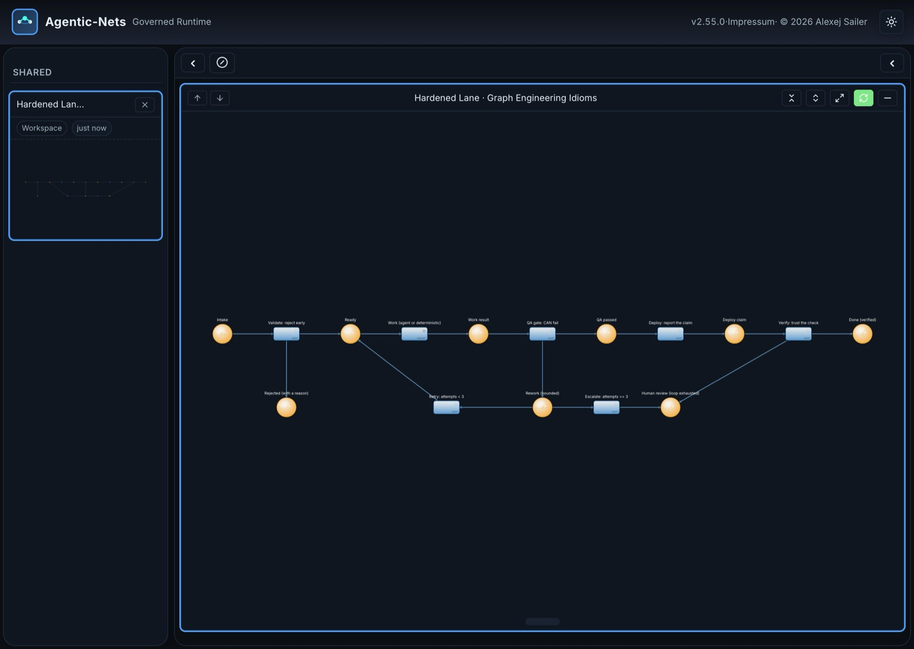

# Chapter 2: Graph Engineering

For the harness. For the engineering. For the AI.

Chapter 1 described what Agentic-Nets is: a governed, event-sourced operating
runtime for persistent, evolving processes. This chapter names the discipline
you practice on top of it.

**Graph Engineering is the practice of designing, operating, and evolving live
process graphs as the primary engineering artifact.** Not the prompt. Not the
script. Not the integration. The graph.

## The Harness Is the Asset

Every AI system that does real work has a harness, whether anyone designed it
or not. The harness is everything around the model: the context it receives,
the stages work moves through, the checks between those stages, the tools it
may touch, the permissions it operates under, and the record of what it did.

Models are visitors. They improve, get replaced, get cheaper, get swapped for
a local one. The harness is what you accumulate. It is where your process
knowledge, your quality gates, and your hard-won lessons live.

Today most harnesses exist implicitly: a prompt loop in a script, a chain of
tool calls inside a chat scaffold, a pile of YAML that only one person
understands. This is automation that cannot see itself. The harness exists,
but nobody can point at it, inspect it, test it, or hand it to someone else.

Graph Engineering makes the harness explicit. The harness becomes a graph:
drawn, executable, inspectable, versioned, and installable.

## What the Artifact Is

The graph engineer's artifact is a live net with a small, strict vocabulary:

- **Places** are state contracts: named locations where work and context wait,
  visible and queryable.
- **Tokens** are the work itself: structured data, not chat history.
- **Transitions** are capabilities: the seven verbs (pass, map, http, llm,
  agent, command, link), deterministic and intelligent side by side.
- **Arcs** are the only allowed flows. If there is no arc, it cannot happen.
- **The policy envelope** wraps all of it: capability flags, tool allowlists,
  vault-resolved credentials, budgets, approvals, executor boundaries.
- **Schedules** give the graph time: crons, intervals, and watchdogs.

This artifact has a property no prompt and no script has: it is
simultaneously the documentation of the process, the implementation of the
process, and the running instance of the process. When someone asks how the
system works, you show them the graph, and the graph is the truth, because
the graph is what executes.

## Why a Graph, Specifically

Three families of tooling compete for this space, and each answers a
different question:

```text
Prompt engineering     tunes the words of ONE model call
Workflow building      wires integrations for ONE run
Graph engineering      builds the durable structure AROUND all of them
```

The graph wins for exactly the reasons that make it feel formal:

- **It is analyzable.** A bipartite graph with explicit state has real
  answers to real questions: can this deadlock, what blocks this transition,
  which place is over capacity, why did nothing happen. The runtime can tell
  you *why a step did not fire*, which is the question that eats debugging
  time in every other architecture.
- **It is governable.** Every flow is an arc and every capability is a
  declaration, so the security review reads the same artifact the runtime
  executes.
- **It is composable.** Nets talk to nets through shared places. A persona, a
  tool, and a monitor are separate graphs cooperating on the same state.
- **It is distributable.** A graph that works installs somewhere else as a
  package, with its structure, policies, and starting state.

## For the Harness: Idioms of a Hardened Lane

Graph Engineering, like every engineering discipline, has idioms: named
patterns you reach for because the failure they prevent has been paid for
already. A hardened work lane looks like this:

```text
[Intake]
    |
    v
Validate            reject early, with a reason
    |
    v
[Ready]
    |
    v
Work                agent or deterministic
    |
    v
QA gate             a check that CAN fail
    |        \
  pass        fail
    |          \
    v           v
[Approved]   [Rework]  bounded: after N attempts,
    |           |      escalate to a human place
    v           v
Deploy       [Human review]
    |
    v
Verify              trust the check, not the deploy log
    |
    v
[Done]
```

This exact lane runs live on the public demo instance, built from the same
seven verbs it teaches and shared read-only. The link is the credential; no
install, no login:

[](https://agentic-nets.com/#/shared-net/bd685551-ed9b-48ff-bf0c-6c32520d6f68)

**[Open the Hardened Lane net](https://agentic-nets.com/#/shared-net/bd685551-ed9b-48ff-bf0c-6c32520d6f68)**,
with story tokens waiting in Intake, one mid-rework with its attempt counter,
and one verified in Done. Look at the badges: the Work step is a real
**agent** transition, read-only capabilities, a six-iteration cap, and a
reply that auto-emits into the QA gate's input place, while every other step
is a deterministic map. One intelligent step, harnessed on all sides, is the
whole point.

The idioms behind it, each learned from a real failure:

- **The complement pair.** Route with conditions that partition all outcomes
  (`== "yes"` beside `!= "yes"`), so no token can fall between two rules.
- **The catch-all emit.** Every transition has a route for the result nobody
  predicted; otherwise the unpredicted result is silently lost or stuck.
- **The bounded loop with a human escape.** Retries are counted with `< N`,
  never with inequality on a string, and the loop's exit on exhaustion is a
  place a person reads.
- **The honest exit.** A step that did nothing must say so with a failure
  route, not report success. A pipeline that cannot say "nothing happened"
  will one day celebrate six empty deliveries in a row.
- **Verify after deploy.** The deploy step reports what it did; a separate
  verification step checks what is actually true.
- **The watchdog lane.** A scheduled transition that only speaks up when
  something is wrong is the cheapest observability there is.

None of these require intelligence. They require structure. That is the
point: the harness supplies the discipline, so the intelligence inside it
does not have to be perfect.

## For the Engineering: The Process Becomes the Program

Because the graph is the artifact, the whole software-engineering toolkit
applies to the process itself:

- **Test it.** Fire a transition once against a synthetic token and inspect
  what lands where. Dry-run a binding before deploying it. Verify an
  inscription statically.
- **Debug it.** When a lane is silent, diagnosis is a query: empty preset,
  capacity block downstream, schedule not due, no executor polling this
  model. The runtime names the reason.
- **Profile it.** Usage reports rank transitions by token burn and separate
  scheduled idling from real work, so the expensive step is a fact, not a
  suspicion.
- **Version it.** Changes are proposed, approved, and applied to a running
  system; the previous structure stays available, so rollback is a stop and
  a start.
- **Ship it.** A graph that works is published to NetHub and installed into
  another runtime, dependencies bundled, credentials scrubbed.

The engineering loop closes over evidence, not opinion: design, run, observe,
analyze, improve, crystallize, run again. The event history is the profiler,
the debugger, and the code review all at once, because every token, fire, and
decision left a record.

## For the AI: A Place to Be Powerful Safely

Inside an engineered graph, AI stops being a loose cannon and becomes a
component with a contract:

- **Bounded invocations.** An llm transition is one call with a schema and a
  timeout; an agent transition is an iterating worker with an iteration cap,
  a tool allowlist filtered by capability flags, and a cost meter whose
  readings land back in the graph as data.
- **Context from places, not from a giant prompt.** The agent receives the
  tokens its arcs deliver: the task, the relevant context, the lessons
  learned. The rest of the process's memory stays where it is.
- **Outputs that face checks.** What the agent produces flows into
  verification transitions like everyone else's work. Trust is structural,
  not assumed.
- **Costs that bend to zero.** When the history shows an agent making the
  same decision the same way, that path is crystallized into deterministic
  transitions with the same contract. On one production lane this took
  821,000 LLM tokens per execution to exactly zero. Intelligence hardens
  into infrastructure, and the remaining AI concentrates where uncertainty
  actually lives.

And then the discipline folds back on itself. Runtime agents practice graph
engineering on the graphs: they read the history, find the bottleneck,
propose the structural change, and route it through the same approval gates a
human change takes. An external coding agent connected over MCP does the
same from outside: it inspects the runtime, builds nets, deploys them, fires
them, reads the results, and improves them. The graph engineer is a role,
and the role is not reserved for humans.

## The Discipline in Ten Plain Sentences

1. **The harness is the asset; models are visitors.**
2. **If the process matters, draw it:** places for state, transitions for
   acts, arcs for what is allowed.
3. **Nothing moves implicitly.** Every step declares what it consumes and
   where its results go.
4. **Checks are steps too.** A quality gate can fail, and failure has a
   route.
5. **Loops are bounded,** and the exit on exhaustion is a place a person
   reads.
6. **Exits are honest.** A step that did nothing says so, or the graph
   learns to celebrate lies.
7. **Silence is diagnosable.** When nothing happens, the runtime can name
   the reason.
8. **Improve on evidence, ship through approval,** and keep the old
   structure for rollback.
9. **Let AI discover the path, then crystallize it,** and spend the
   intelligence where uncertainty remains.
10. **The graph outlives the model that helped build it.**

## See It Practiced

- [The Hardened Lane, live](https://agentic-nets.com/#/shared-net/bd685551-ed9b-48ff-bf0c-6c32520d6f68):
  this chapter's example net running read-only on the public demo instance.
- [The Harness Control System](../whitepaper/the-harness-control-system.html):
  the whitepaper this chapter compresses, with the control loop in full.
- [Watch an AI agile team ship a real change](https://www.youtube.com/watch?v=VBomzW-xqfc&list=PLQirdTX_nt94):
  a hardened lane doing real work, end to end.
- The live read-only nets from
  [Chapter 1](chapter-01-what-agentic-nets-is.md#see-it-live), including
  [12 · Crystallization: AI first, then free](https://agentic-nets.com/#/shared-net/c989eac2-b6ef-4b35-a107-6ac3ef26d469),
  which is this chapter's argument running as a graph.
